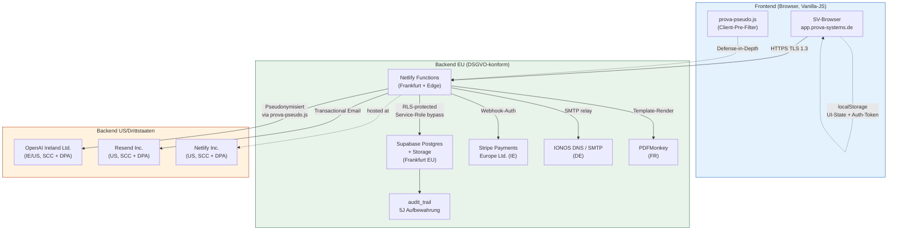
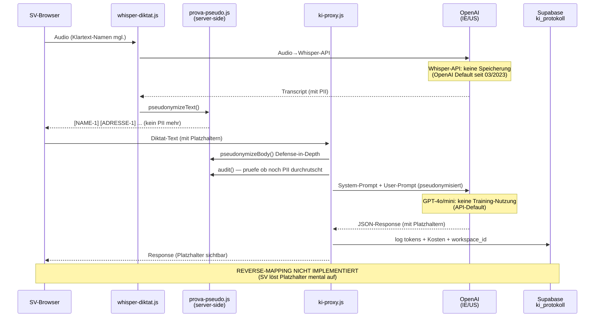
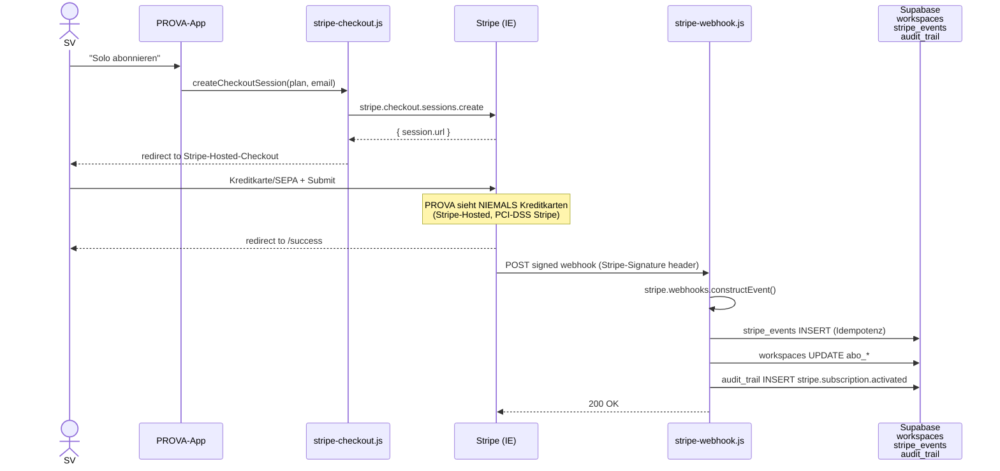
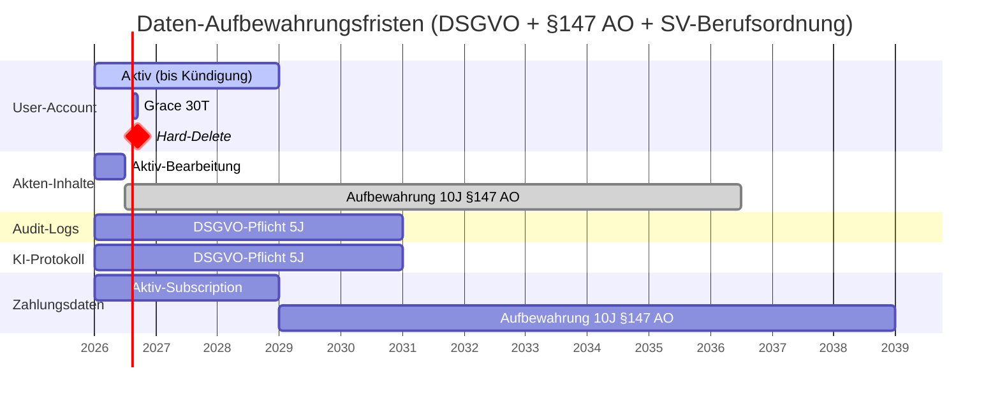

# PROVA DSGVO-Datenflussdiagramm

**Stand:** 03.05.2026 (Sprint S6 — Mega-Mega-Nacht)
**Zweck:** Vollständige Visualisierung der personenbezogenen Datenflüsse für DSGVO Art. 30 (Verzeichnis von Verarbeitungstätigkeiten) + Art. 28 (Auftragsverarbeiter-Verträge).

---

## High-Level-Datenfluss



---

## Datenkategorien-Matrix

| Kategorie | Quelle | Speicherort | Subprozessor | Rechtsgrundlage | Aufbewahrung |
|---|---|---|---|---|---|
| **SV-Stammdaten** (Name, Adresse, IHK, IBAN) | User-Eingabe Profil-Page | Supabase `users` + `workspaces` (EU) | Supabase | Art. 6 (1) b — Vertragserfüllung | bis Kündigung + 30T |
| **Auftraggeber-PII** (Name, Adresse, Email, Tel) | User-Eingabe Akte | Supabase `kontakte` (EU) | Supabase | Art. 6 (1) b + f | 10J nach Akte-Abschluss (§147 AO) |
| **Akten-Inhalte** (Diktat, Befunde, §6 Fachurteil) | User-Eingabe + Whisper | Supabase `auftraege`, `befunde`, `notizen` (EU) | Supabase | Art. 6 (1) b + §203 StGB Schweigepflicht | 10J (§147 AO + SV-Berufsordnung) |
| **Audio (Diktat)** | Mic-Recording | Supabase Storage `audio_dateien` (EU) | Supabase + OpenAI Whisper (IE/US) | Art. 6 (1) b + Einwilligung (§407a) | bis Akten-Abschluss + 6 Mo |
| **Foto-Anhänge** | Foto-Upload | Supabase Storage `fotos` (EU) | Supabase + OpenAI Vision (Captioning, IE/US) | Art. 6 (1) b | mit Akte 10J |
| **Pseudonymisierte KI-Prompts** | server-side `prova-pseudo.js` | OpenAI API (IE/US) | OpenAI Ireland Ltd. | Art. 6 (1) b + DPA + SCC | OpenAI: keine Speicherung (Default seit 03/2023) |
| **PDF-Gutachten** | PDFMonkey-Render | Supabase Storage + Browser-Download | PDFMonkey SAS (FR) | Art. 6 (1) b | mit Akte 10J |
| **Email-Inhalte** (Mahnung, Brief) | User-Komposition | IONOS SMTP / Resend | IONOS (DE) / Resend (US) | Art. 6 (1) b | nach Versand: kein PROVA-Speicher; Empfänger speichert |
| **Zahlungsdaten** (Email, Stripe-Customer-ID) | Stripe-Checkout-Flow | Stripe (IE) + Supabase `workspaces.stripe_*` | Stripe Payments Europe Ltd. (IE) | Art. 6 (1) b | Stripe: 7J ; PROVA: bis Kündigung |
| **Audit-Logs** (Login, Daten-Zugriff, KI-Aufruf) | server-side automatic | Supabase `audit_trail` (EU) | Supabase | Art. 6 (1) f + Art. 5 (1) f | 5 Jahre |
| **KI-Protokoll** (Tokens, Modell, Kosten) | server-side `ki-proxy.js` | Supabase `ki_protokoll` (EU) | Supabase | Art. 6 (1) f | 5 Jahre |
| **DSGVO-Einwilligungen** | User-Klick Onboarding | Supabase `einwilligungen` (EU) | Supabase | Art. 7 (1) Pflicht | 5 Jahre nach Widerruf |
| **Cookies + LocalStorage** | Frontend-State | Browser (lokal) | (kein Subprozessor) | Art. 6 (1) f + Einwilligung (Tracking-Cookies) | Session bis Logout-Wipe |

---

## KI-Datenfluss-Detail (kritisch — §6 KI-Verarbeitung)



**Wichtige Eigenschaften:**

1. **Audio enthält Klartext-PII** (Whisper kann nicht clientseitig pseudonymisieren). Mitigation: OpenAI-DPA + No-Training-Default + Daten-Verarbeitung in Whisper-API ist transient (kein Speichern bei OpenAI laut API-Doc).

2. **Text-Pfad ist DSGVO-strikt:** Server-Side-Pseudonymisierung vor jedem KI-Call + Reverse-Audit + ki_protokoll-Logging.

3. **Kein Reverse-Mapping:** Server speichert keine Map `[NAME-1] → "Max Müller"`. Wenn Map gestohlen wird → keine Datenwiederherstellung möglich. DSGVO-best-practice.

4. **Foto-Captioning** (`foto-captioning.js`): Bilder können Klartext-Schilder, Personen, Adressen enthalten. Pseudo greift auf Bilder nicht. Mitigation: SV ist verantwortlich, Bilder ohne PII zu erstellen + DPA mit OpenAI.

---

## Stripe-Datenfluss



**DSGVO-Eigenschaften:**

- **Kreditkarten-Daten:** PROVA erfasst sie NIE (Stripe-Hosted-Checkout, PCI-DSS-Compliance liegt bei Stripe)
- **Speicherung:** nur Stripe-Customer-ID, Subscription-ID, Email — keine Karten/IBAN
- **EU-Verarbeitung:** Stripe Payments Europe Ltd. (Dublin, IE) — kein Drittstaaten-Transfer für Zahlungen
- **Audit-Trail:** jede Stripe-Aktion → `audit_trail`-Eintrag

---

## Pseudonymisierungs-Touchpoints

```mermaid
flowchart LR
    Diktat["User-Diktat<br/>(mit PII)"]
    Whisper["whisper-diktat.js<br/>+ ProvaPseudo.apply()"]
    Frontend["SV-Browser<br/>(zeigt Platzhalter)"]
    KI["ki-proxy.js<br/>+ pseudonymizeBody()<br/>+ audit() reverse-check"]
    OAI["OpenAI<br/>(sieht NUR Platzhalter)"]

    Diktat --> Whisper
    Whisper -->|"[NAME] [ADRESSE]<br/>[EMAIL] [IBAN] [TEL]"| Frontend
    Frontend -->|edit| KI
    KI --> OAI
    OAI -->|Response<br/>(Platzhalter)| KI
    KI --> Frontend

    style OAI fill:#fff3e0,stroke:#bf360c
    style Whisper fill:#e8f4ea,stroke:#2d6a4f
    style KI fill:#e8f4ea,stroke:#2d6a4f
```

**Regex-Patterns** (`netlify/functions/lib/prova-pseudo.js`):
- IBAN: `\bDE\s?\d{2}(?:\s?\d{4}){4}\s?\d{2}\b` + International
- Email: `[\w.+-]+@[\w-]+(?:\.[\w-]+)+`
- Telefon: deutsche Formate (`+49…`, `0…`, `0176…`)
- PLZ + Ort: `\b\d{5}\s+[A-ZÄÖÜ]…`
- Straße + Hausnummer: `\b[A-ZÄÖÜ]…(?:straße|weg|platz|allee|…)\s+\d+`
- Personen-Namen mit Kontext: `\b(?:Herr|Frau|Dr\.|Prof\.|Auftraggeber|…)\s+([A-ZÄÖÜ]…)`

**Bekannte Lücke (Sprint 9 Pflicht-Fix):** `normen-picker.js` smart-mode sendet ungeschütztes Diktat-Auszug an OpenAI — siehe `docs/audit/2026-05-02-owasp-llm-top10.md` LLM06.

---

## Migration-Pfad Airtable → Supabase (DSGVO-Notiz)

| Periode | Daten-Backend | Datentransfer | Status |
|---|---|---|---|
| bis 27.04.2026 | Airtable (US) + Cloudinary (US) + Make.com (CZ) + Netlify Identity (US) | EU-User-Daten in US-Cloud | Alt-Stack — DSGVO-Schwächer |
| 27.04.→02.05. | Voll-Supabase-Refactor | Airtable-Daten via Migration-Pipeline (`scripts/migrate/`) nach Supabase EU | Migration-Sprint K-1.x |
| ab 02.05.2026 | Supabase EU exklusiv | Airtable als Subprozessor abgemeldet | Voll-Cleanup-Sprint Tag `v203` |
| 03.05.2026 | + neuer Stripe-Account (EU-Verarbeitung) | alter Sandbox-Stripe-Account deprecated | aktuelle Architektur |

**0-Kunden-Migration:** keine Migrations-Risiken weil keine Bestandsdaten. Sauberer Cutover.

---

## Datensubjekt-Rechte (Art. 15-22)

| Recht | Implementation | Trigger |
|---|---|---|
| **Art. 15 Auskunft** | DB-Function `dsgvo_user_export()` + `dsgvo-auskunft.js` Endpoint → JSON-Export | User-Klick in Profil-Page |
| **Art. 16 Berichtigung** | direktes Edit in Frontend (alle PII-Felder editable) | User-Eigenständig |
| **Art. 17 Löschung** | DB-Function `dsgvo_user_loeschen()` + `dsgvo-loeschen.js` Endpoint → 30T Grace, dann Hard-Delete | User-Klick + Confirmation |
| **Art. 18 Einschränkung** | manueller Marcel-Workflow (Account-Status `pausiert`) | Email-Anfrage |
| **Art. 20 Datenübertragbarkeit** | analog Art. 15, JSON-Format | analog |
| **Art. 21 Widerspruch** | manueller Marcel-Workflow | Email-Anfrage |
| **Art. 22 Automatisierte Entscheidung** | KI-Hilfen sind keine automatisierten Entscheidungen (Marcel-Doktrin Regel 8 — KI macht NIE eigenständige Bewertungen) | n/a |

---

## Aufbewahrungsfristen-Übersicht



---

## Bekannte DSGVO-Restrisiken

| Risiko | Mitigation | Restrisiko-Level |
|---|---|---|
| OpenAI-Whisper hört Klartext-Namen aus Audio | DPA + No-Training-Default + Audio nur kurzzeitig in API | NIEDRIG |
| Foto-Captioning sieht Klartext-Schilder/Personen | SV-Verantwortung + DPA OpenAI | NIEDRIG |
| KI-008 Normen-Picker sendet ungeschütztes Diktat | **HIGH-Backlog Sprint 9** | MITTEL |
| auth_token im localStorage (XSS-Steal-Vektor) | CSP + Input-Sanitization (Phase 1.9) | NIEDRIG |
| Akten-Inhalte in localStorage (Multi-User-PC) | Logout-Wipe-Pflicht (zu verifizieren) | MITTEL |
| Whisper-Audio-Pfad: Klartext-PII transient bei OpenAI | DPA + EU-Subprozessor | NIEDRIG |

→ Vollständige Liste: `docs/audit/BACKLOG.md`

---

*DSGVO-Dataflow 03.05.2026 · Konsistent mit `PROVA-ARCHITEKTUR-MASTER.md` Subprozessoren-Sektion · Anwalt-Review für AVV/Datenschutzerklärung pending*
