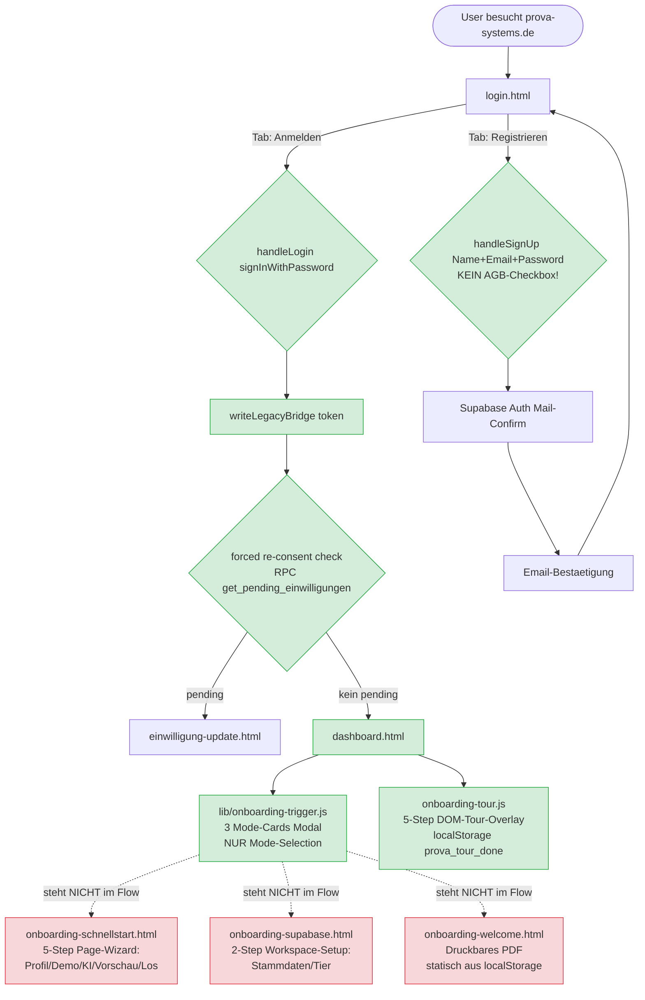

# MEGA²⁰ — Onboarding Tiefen-Audit (KEIN Code, nur Analyse)

**Sprint:** MEGA²⁰ (Onboarding-Foundation mit Audit-First)
**Datum:** 2026-05-08
**Status:** ⏸️ **Audit-Checkpoint** — Marcel-Freigabe pflicht vor Implementation

---

## ⚠️ KRITISCH: 2 grosse Konflikte zur Marcel-Direktive gefunden

### 🔴 Konflikt 1: `legal_acceptances` ist **DUPLIKAT** existing `einwilligungen`

Marcel-Direktive verlangt:
```sql
-- Migration 10:
CREATE TABLE legal_acceptances (
  id UUID, user_id, type TEXT, version TEXT,
  accepted_at, ip_address INET, user_agent TEXT, ...
);
```

**Existing in Migration 04** (`supabase-migrations/04_schema_komplett_finale.sql:1292`):
```sql
CREATE TABLE public.einwilligungen (
  id UUID, workspace_id, user_id,
  typ einwilligung_typ NOT NULL,         -- ENUM (agb, datenschutzerklaerung, avv_*, newsletter, ki_einsatz, ...)
  rechtsdokument_id UUID,                -- FK auf rechtsdokumente (Versions-Tracking)
  version TEXT NOT NULL,
  inhalt_hash TEXT NOT NULL,             -- DSGVO-Beweis: WAS wurde unterschrieben
  erteilt_at TIMESTAMPTZ,
  ip_address INET, user_agent TEXT, session_id UUID,
  onboarding_schritt TEXT, page_url TEXT,
  widerrufen_at TIMESTAMPTZ, widerruf_grund TEXT,
  ...
);
```

**Diese Tabelle ist DSGVO-Art-7-konform und vollstaendig.** Mehr als Marcels Vorschlag.

**Empfehlung:** legal_acceptances NICHT erstellen. einwilligungen wiederverwenden.

### 🔴 Konflikt 2: `user_profile` Tabelle existiert **NICHT** — Marcel meinte vermutlich `users`

Marcel-Direktive Migration 11:
```sql
ALTER TABLE user_profile ADD COLUMN onboarding_completed BOOLEAN, persona_size TEXT, ...
```

**Existing:** Tabelle heisst `public.users` (Migration 01:165), NICHT `user_profile`. Hat bereits:
- `onboarding_completed_at TIMESTAMPTZ` (Zeile 178)

Marcel-Migration-11-Spalten muessen also auf `public.users` gehen.

---

## 1. Aktueller Onboarding-Flow (Mermaid)



**Erkenntnis:** Es gibt **5 separate Onboarding-Konzepte** parallel:
1. **lib/onboarding-trigger.js** — Mode-Selection-Modal (MEGA¹⁷+¹⁹, A11y-Premium) — aktiv via dashboard.html
2. **onboarding-tour.js** — DOM-Tour-Overlay mit Highlights — vermutlich in dashboard.html eingebunden
3. **onboarding-schnellstart.html** — 5-Step-Page-Wizard mit Demo-Fall — **orphan** (kein Link aus dashboard)
4. **onboarding-supabase.html** — 2-Step Workspace-Setup — **orphan** (Tier-Wahl-Page)
5. **onboarding-welcome.html** — Druckbares PDF-Dokument — **orphan** (statisches Print-Doc)

---

## 2. Files: Vollstaendige Analyse

### KEEP — bleibt unangetastet
| File | Zweck | Status |
|---|---|---|
| `login.html` | Auth-Form (Login/Signup/Reset) | KEEP, **erweitern** mit AGB-Checkboxes |
| `auth-supabase-logic.js` | Auth-Handler + Forced-Re-Consent | KEEP, **erweitern** um Legal-Acceptance-Logging |
| `lib/auth-guard.js` | Auth-Bridge nach Login | KEEP |
| `dashboard.html` | App-Entry | KEEP, Wizard-Trigger ist schon eingebunden |

### KEEP + ERWEITERN
| File | Aktion |
|---|---|
| `lib/onboarding-trigger.js` | **Erweitern** von 1-Step (Mode) auf 4-Step Modal-Wizard. A11y-Features bleiben. |
| `onboarding-tour.js` | **Wiederverwenden** als Step 3 des erweiterten Wizards |

### MERGE — Inhalte uebernehmen, Page archivieren
| File | Strategie |
|---|---|
| `onboarding-schnellstart.html` | Inhalts-Patterns (Profil-Form, Demo-Fall) als Step 1 + Step 4 in den Modal-Wizard uebernehmen. Dann **deaktivieren** (aber NICHT loeschen — Risiko Cross-Refs). |

### KEEP — anderer Use-Case
| File | Begruendung |
|---|---|
| `onboarding-supabase.html` | Workspace-Setup (Tier-Wahl) — **NICHT der Welcome-Wizard**. Wird vermutlich nach Signup als Workspace-Anlage genutzt. **NICHT antasten** in MEGA²⁰. |
| `onboarding-welcome.html` | Druckbares Print-PDF — **NICHT der Welcome-Wizard**. Marcel-Wunsch: SV bekommt Welcome-PDF zum Ausdrucken. **NICHT antasten** in MEGA²⁰. |
| `onboarding-logic.js` + `onboarding-supabase-logic.js` | JS-Logic zu den orphan-Pages — bleiben unangetastet. |

### LÖSCHEN
**KEINE Dateien loeschen in MEGA²⁰.** Risiko Cross-References zu hoch. Marcel kann in MEGA²¹+ entscheiden.

---

## 3. Schema-Status (DSGVO Art. 7)

### ✅ existiert bereits (Migration 04)
- `public.einwilligungen` — DSGVO-Beweis-Tabelle (inhalt_hash + ip + user_agent + page_url)
- `public.rechtsdokumente` — AGB/DSE/AVV mit Versionierung (parent_doc_id + aktuell-Flag)
- `einwilligung_typ` ENUM: agb, datenschutzerklaerung, avv_auftragsverarbeitung, newsletter, ...
- `rechtsdoc_typ` ENUM: agb, datenschutzerklaerung, avv, ...
- RPC `get_pending_einwilligungen()` (in auth-supabase-logic.js Zeile 119 verwendet — existiert bereits!)
- RPC `record_einwilligung(typ, version)` (CLAUDE.md erwaehnt — vmtl. in Migration 04)

### ❌ fehlt fuer MEGA²⁰
- **In login.html:** AGB/AVV/DSGVO-Checkboxes im Signup-Tab
- **Backend:** `log-legal-acceptance.js` Lambda als Wrapper um `record_einwilligung()`
- **In auth-supabase-logic.js:** Nach Signup → log-legal-acceptance Calls fuer agb/datenschutzerklaerung/avv

### ❌ fehlt fuer Persona (Marcel-Direktive Migration 11)
- `public.users.persona_size TEXT` (solo/small/large)
- `public.users.persona_types JSONB` (Auftragsarten-Array)
- `public.users.persona_volume INTEGER` (Gutachten/Monat)
- **Anmerkung:** `onboarding_completed_at TIMESTAMPTZ` existiert bereits → kann als done-Marker dienen (timestamp != NULL = onboarded)

### Migration-Empfehlung
- **NEU Migration 10** = `users.persona_*` columns (NICHT legal_acceptances)
- **KEINE** Migration fuer legal_acceptances — einwilligungen + rechtsdokumente reichen

---

## 4. Probleme + Konflikte

### 🔴 Hochrisiko
1. **legal_acceptances vs einwilligungen** — Duplikat-Risiko (siehe oben)
2. **user_profile vs users** — Naming-Konflikt (siehe oben)
3. **lib/onboarding-trigger.js Mode-Selection wird beim Erweitern auf 4-Step zerbrochen wenn nicht sorgfaeltig** — A11y-Features (Esc/Click-outside/Focus-Trap) muessen pro Step funktionieren

### 🟡 Mittelrisiko
4. **AGB-Page existiert** (`agb.html` am Root) — Marcel-Direktive will "Senior-Legal-Niveau" + "PDF-Download-Button" ueberarbeiten. Wir wissen nicht wie der existing-Inhalt aussieht.
5. **forced re-consent** ist bereits in auth-supabase-logic.js verdrahtet via `get_pending_einwilligungen` RPC. Nach AGB-Update werkt das. Marcel-Direktive will das aber explizit als "Re-Acceptance-Logic" — schon da, muss verifiziert werden dass es korrekt verlinkt.
6. **onboarding-schnellstart.html** "5-Step" ist conceptuell aehnlich zu Marcels "4-Step Wizard", aber:
   - Schnellstart ist eine PAGE (loescht User-Kontext beim Zurueckspringen)
   - Marcel will MODAL (User bleibt im Dashboard-Kontext)

### 🟢 Niedrigrisiko
7. **Test-Akte erstellen** (Step 4) — Mock-Daten-Erstellung in einer Akte. Workflow-Frage: in eigenem Workspace + Demo-Flag setzen?
8. **Email-Drip** (Make.com Scenarios T2-T6) — Marcel-Pflicht (eigenes Make.com-Account), wir koennen nur die Trigger-Hooks vorbereiten

---

## 5. Migration-Strategie (Empfehlung)

### Phase 1 — Login Erweitern (60 Min)
1. login.html Signup-Tab um 3 Checkboxes (AGB+AVV+DSGVO) + 1 Toggle (Newsletter)
2. auth-supabase-logic.js handleSignUp erweitern um log-legal-acceptance Calls (4x: agb/dse/avv/newsletter falls toggled)
3. log-legal-acceptance.js Lambda (Wrapper um record_einwilligung RPC)
4. **KEINE** legal_acceptances-Migration (einwilligungen wiederverwenden)

### Phase 2 — Welcome-Wizard (90 Min)
1. Migration 10: ALTER TABLE public.users ADD COLUMN persona_size + persona_types + persona_volume
2. lib/onboarding-trigger.js erweitern auf 4-Step Modal:
   - Step 1: Persona (Buero-Groesse + Auftragsarten + Volume)
   - Step 2: Mode-Selection (existing, bleibt unveraendert in Step 2)
   - Step 3: Tour starten? (Wrapper um onboarding-tour.js)
   - Step 4: Test-Akte erstellen?
3. Bestehende A11y-Features (Esc/Click-outside/Focus-Trap) auf Multi-Step-Modal anpassen
4. completion-Flag: `users.onboarding_completed_at = NOW()` setzen via Lambda (kein doppeltes localStorage!)

### Phase 3 — Post-Onboarding (60 Min)
1. lib/in-app-hints.js — Toast-System fuer Smart-Hints
2. hilfe.html Video-Slots (5 Iframe-Placeholder)
3. Email-Drip-Hooks dokumentiert (Marcel macht Make.com-Side)

### Phase 4 — Tests + Final-Report (30 Min)
1. Tests fuer Legal-Checkboxes + Welcome-Wizard + Persona + In-App-Hints
2. Final-Report mit User-Journey-Diagramm + Marcel-Test-Anleitung

---

## 6. Capacity-Estimate

| Tier | Tasks | Token | Confidence |
|---|---|---:|---:|
| **PRIMARY** | Phase 1+2+4 (Login + Wizard + Tests + Final) | ~80k | 80% |
| **STRETCH** | + Phase 3 (In-App-Hints + Video-Slots) | +25k | 40% |
| **ULTIMATE** | + agb.html/avv.html ueberarbeiten | +20k | 15% |

**Note:** Bin nach 19 MEGA-Sprints in einer Session. Restbudget realistisch ~80-100k. PRIMARY confirmed, STRETCH wird knapp.

---

## 7. Kritische Marcel-Decisions vor Implementation

### Entscheidung A: `legal_acceptances` vs `einwilligungen`
- [ ] **Option A1 (empfohlen):** einwilligungen wiederverwenden, KEIN legal_acceptances
- [ ] Option A2: legal_acceptances anlegen + spaeter migrieren (DOPPEL-Schema, schlecht)

### Entscheidung B: Persona-Tabelle
- [ ] **Option B1 (empfohlen):** ALTER TABLE public.users ADD persona_*
- [ ] Option B2: Neue Tabelle public.user_persona_setup (eigene)

### Entscheidung C: orphan-Pages
- [ ] **Option C1 (empfohlen):** onboarding-schnellstart/welcome/supabase **NICHT antasten** in MEGA²⁰
- [ ] Option C2: alle ersetzen durch Modal-Wizard (RISIKO: Cross-Refs brechen)

### Entscheidung D: Test-Akte (Step 4)
- [ ] **Option D1:** Echte Akte mit Demo-Flag erstellen + im Workspace zeigen
- [ ] Option D2: Nur Pseudo-Akte im UI (Cache-only)
- [ ] Option D3: Step 4 entfernen / als Demo-Modus auf bestehender Akte

### Entscheidung E: agb.html/avv.html ueberarbeiten?
- [ ] **Option E1 (empfohlen):** ULTIMATE — nicht in MEGA²⁰. Marcel laesst von Anwalt finalisieren.
- [ ] Option E2: STRETCH — Senior-Legal-Niveau-Update jetzt

---

## 8. Risiko-Bewertung

| Item | Risiko | Mitigation |
|---|---|---|
| login.html-Erweiterung | 🟢 niedrig | nur Form-Inputs hinzu, existing JS untouched |
| log-legal-acceptance.js | 🟢 niedrig | reiner Wrapper um existing RPC |
| Migration 10 (persona_*) | 🟡 mittel | ALTER TABLE auf live-Tabelle — aber idempotent (IF NOT EXISTS) |
| 4-Step Wizard-Erweiterung | 🟡 mittel | A11y-Tests muessen pro Step gruen sein |
| Test-Akte-Erstellung | 🔴 hoch | wenn echte Akte: data-store auftraege.create — kann RLS-Probleme triggern |
| onboarding-schnellstart Inhalts-Patterns wiederverwenden | 🟢 niedrig | nur HTML-Snippets kopieren |
| Forced Re-Consent verifizieren | 🟢 niedrig | RPC existiert + ist verdrahtet |

---

## 9. Empfohlener Implementation-Plan (NACH Marcel-OK)

```
W82  — Migration 10 (users.persona_*)
W83  — log-legal-acceptance.js Lambda + Tests
W84  — login.html: AGB-Checkboxes + auth-supabase-logic.js erweitert
W85  — lib/onboarding-trigger.js → 4-Step Multi-Wizard (Step 1: Persona)
W86  — Step 2 (Mode bleibt) + Step 3 (Tour-Trigger) + Step 4 (Test-Akte)
W87  — Tests durchgehend (mind. 40 neu)
W88  — Final-Report + sw.js v280
```

Ehrliche Backlog (NICHT in MEGA²⁰, MEGA²¹+ wenn Marcel will):
- Phase 3: In-App-Hints + Video-Slots + Email-Drip-Make.com-Setup
- agb.html/avv.html Senior-Legal-Niveau-Ueberarbeitung
- Migration aus orphan-Pages → Wizard-Modal-Steps
- Loeschen orphan-Pages

---

## 10. ⏸️ STOPP-CHECKPOINT

**Marcel — bevor ich irgendwas baue:**

1. ✅ Audit-Doc geschrieben (this file)
2. ❓ **Marcel-Decisions A-E pflicht** (Section 7)
3. ❓ **PRIMARY vs STRETCH vs ULTIMATE OK?** (Section 6)
4. ❓ **Implementation-Plan W82-W88 OK?** (Section 9)

**Antworten bitte als Markdown-Liste (kann auch nur "alles A1/B1/C1/D1/E1") — dann starte ich mit W82.**

**Wenn etwas in der Annahme falsch ist** (z.B. einwilligungen-Tabelle existiert NICHT, oder du willst trotzdem legal_acceptances), bitte korrigieren — bevor ich Code schreibe.

---

*Audit-Stand: 2026-05-08. Kein Code geschrieben. Marcel-Freigabe pflicht.*
