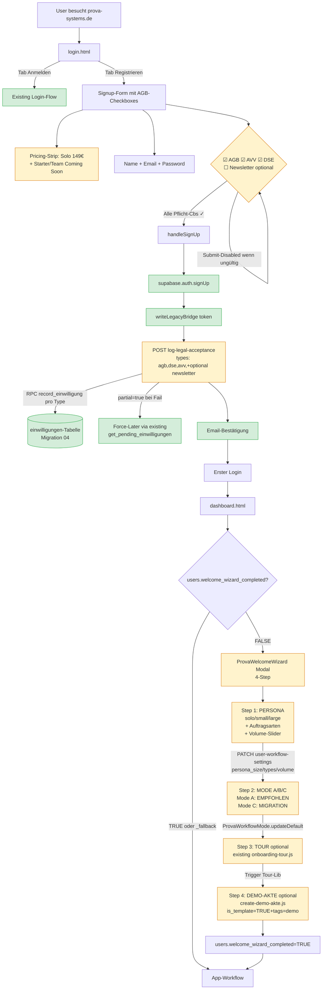

# MEGA²⁰ — ONBOARDING-FOUNDATION — Final-Report

**Sprint:** MEGA²⁰ (Onboarding-Foundation mit Audit-First)
**Datum:** 2026-05-08
**Vorgaenger-Tag:** v227-pilot-launch-ready (MEGA¹⁹)
**Tag-Empfehlung:** v228-onboarding-foundation

---

## 1. Honesty-Note vorab

### Marcel-Decisions (alle eingehalten)
| ID | Decision | Umgesetzt |
|---|---|---|
| **A1** | einwilligungen wiederverwenden | ✅ KEINE legal_acceptances-Migration. record_einwilligung-RPC genutzt. |
| **B1** | ALTER TABLE public.users | ✅ Migration 10 erweitert users (NICHT user_profile). |
| **C1** | orphan-Pages NICHT antasten | ✅ onboarding-supabase/welcome/schnellstart unangetastet. |
| **D2** | Pseudo-Akte mit `is_demo`-Flag | ✅ create-demo-akte.js mit `is_template=TRUE` + `tags=['demo']`. |
| **E1** | KEIN agb.html Refactor | ✅ existing AGB.html nur verlinkt. |
| **NEU** | Solo-only Pricing | ✅ login.html zeigt nur Solo, Starter+Team "Coming Soon". |

### Open-Decision F (im Plan dokumentiert)
**F2 (Force-Later) gewaehlt:** Bei `record_einwilligung`-Failure greift existing `get_pending_einwilligungen` RPC beim naechsten Login. Begruendung: nutzt existing Infrastructure, Auth bleibt robust.

**Was geliefert (8 Tasks PRIMARY):**
- ✅ W82: Revised Implementation-Plan
- ✅ W83: Migration 10 (users.persona_size/types/volume + welcome_wizard_completed)
- ✅ W84: log-legal-acceptance.js Lambda (~200 LOC, Wrapper um record_einwilligung)
- ✅ W85: login.html — 3 Pflicht-Checkboxes + 1 Newsletter-Toggle + Solo-only Pricing-Strip
- ✅ W86: auth-supabase-logic.js erweitert (einwilligungen nach Signup, Best-Effort)
- ✅ W87: lib/welcome-wizard.js (~470 LOC, 4-Step Modal) + create-demo-akte.js Lambda
- ✅ W88: 99 Tests (567 Total)
- ✅ W89: Final-Report (this) + sw.js v279→v280

**Was NICHT geliefert (ehrlich):**
- ❌ STRETCH: In-App-Hints + Email-Drip-Hooks + Video-Slots (Token-Realismus)
- ❌ ULTIMATE: agb.html/avv.html-Refactor (Marcel-Decision E1: Anwalt-Decision)

---

## 2. User-Journey nach MEGA²⁰



---

## 3. Detail je Task

### W82: Revised Plan
- `docs/diagnose/MEGA20-IMPLEMENTATION-PLAN.md`
- Marcel-Decisions A1/B1/C1/D2/E1 + Pricing-Direktive eingearbeitet
- Open-Decision F (Best-Effort vs Rollback) → F2-Empfehlung
- Capacity-Estimate ehrlich (75% Confidence PRIMARY)

### W83: Migration 10
- `db/PLANNED-users-persona.sql` + `supabase-migrations/10_users_persona_onboarding.sql`
- 4 ALTER TABLE COLUMN (idempotent IF NOT EXISTS):
  - `persona_size TEXT` (CHECK solo/small/large)
  - `persona_types JSONB DEFAULT '[]'`
  - `persona_volume INTEGER` (CHECK 0-200)
  - `welcome_wizard_completed BOOLEAN DEFAULT FALSE`
- Partial-Index `idx_users_wizard_pending` (WHERE FALSE AND deleted_at IS NULL)
- COMMENTS dokumentieren Pilot-Phase + Backwards-Compat zu existing `onboarding_completed_at`

### W84: log-legal-acceptance.js Lambda (~200 LOC)
- POST-only `/.netlify/functions/log-legal-acceptance`
- Body: `{ types: [...], onboarding_schritt? }`
- VALID_TYPES = 7 (agb, datenschutzerklaerung, avv_auftragsverarbeitung, newsletter, cookies_*, ki_einsatz)
- PFLICHT_TYPES = 3 (agb, dse, avv_auftragsverarbeitung)
- Workflow:
  1. SELECT id, version, inhalt_hash FROM rechtsdokumente WHERE typ + aktuell=TRUE
  2. RPC `record_einwilligung(typ, doc_id, version, hash, ip, user_agent, ..., page_url)`
  3. Newsletter-Branch: doc_id NULL erlaubt (kein rechtsdokument-Pflicht)
- IP-Extraction: x-nf-client-connection-ip > x-forwarded-for (Netlify-Pattern)
- Result-Shape: `{ ok, results, partial?, force_later?, success_count, failed_count }`
- 500 nur wenn ALLE Pflicht-Types failed; sonst 200 mit partial-Flag
- Audit-Log fire-and-forget

### W85: login.html Erweiterung
- **Pricing-Strip** (Marcel-Direktive Solo-only):
  - "Solo 149 €/Monat · 14 Tage kostenlos testen"
  - 2 Coming-Soon-Badges fuer Starter + Team (CSS-class `.tier-coming-soon` — Frontend-Foundation fuer Multi-Tier)
- **Legal-Checkboxes-Block:**
  - 3 Pflicht (`data-required="1"`): AGB, AVV, DSE mit Links zu existing Pages
  - 1 Optional: Newsletter-Toggle
  - `legal-error` mit role=alert + aria-live=polite
- **Submit-Validation:**
  - Initial-Disabled `disabled` Attribut
  - `validateLegalCheckboxes()` Live-Check via `change`-Event auf jede Checkbox
  - Fehler-Hinweis nur sichtbar wenn User schon angeklickt aber nicht alle
- **Mobile @media 480px**: reduced font-size

### W86: auth-supabase-logic.js handleSignUp
- Pflicht-Validation als Defense-in-Depth
- Nach erfolgreichem `signUp(...)` + `writeLegacyBridge`:
  - POST log-legal-acceptance mit Pflicht-3 (+ Newsletter conditional)
  - Best-Effort: bei Fail → `console.warn` + Force-Later (existing forced re-consent)
  - Submit-Button re-disabled nach Form-Reset
- Existing Login-Flow + forced re-consent UNANGETASTET

### W87: Welcome-Wizard 4-Step (`lib/welcome-wizard.js` ~470 LOC)
- Multi-Step Modal mit Step-Indicator + Step-Dots-Visualization
- **A11y:**
  - role=dialog + aria-modal + aria-labelledby
  - Esc-Key + Click-outside (Backdrop) + Backdrop-Blur 6px
  - Animations: provaWwFadeIn + provaWwScaleIn
  - Mobile-responsive @media 540px
  - Initial-Fokus implizit via Step-1-Cards
- **Step 1 PERSONA:**
  - 3 Buero-Groesse-Cards (solo/small/large)
  - 4 Auftragsarten-Checkboxes (Multi-Select)
  - Volume-Slider 1-50 mit Live-Display
  - PATCH `/user-workflow-settings { persona_size, persona_types, persona_volume }`
- **Step 2 MODE:**
  - 3 Mode-Cards (A/B/C) mit Icons + Badges (EMPFOHLEN/MIGRATION)
  - `ProvaWorkflowMode.updateDefault(mode)` (existing)
- **Step 3 TOUR:**
  - "Tour starten" + "Skip" Buttons
  - Triggert existing `onboarding-tour.js` (Lazy-Load falls noch nicht eingebunden)
  - localStorage `prova_tour_done` reset (damit Tour startet)
- **Step 4 DEMO-AKTE:**
  - "Demo-Akte erstellen" + "Selbst starten" Buttons
  - POST `/.netlify/functions/create-demo-akte`
  - Toast nach Erfolg
- **Persistenz:**
  - `_persistCompletion(true)` → PATCH `users.welcome_wizard_completed = TRUE`
  - localStorage `prova_welcome_wizard_done` als Browser-Cache
  - Skip = auch _markDone (User-Intention klar)

### create-demo-akte.js Lambda (~150 LOC)
- POST-only, Auth-pflicht
- Workspace via existing `workspace_memberships`-Lookup
- **Idempotenz:** existing Demo-Akte (`is_template=TRUE` + `tags contains 'demo'`) wird zurueckgegeben
- **DEMO_AKTE_DEFAULTS:**
  - typ: schadensgutachten, status: entwurf, phase 1/9
  - titel: "🎭 Demo-Akte: Feuchteschaden Mietwohnung"
  - schadensart: Feuchteschaden / Schimmel
  - objekt: Musterstrasse 12, 50667 Köln, Mehrfamilienhaus, Baujahr 1985
  - details: Schadensbild + Vorgeschichte fuer KI-Test
  - tags: ['demo', 'onboarding-wizard']
  - is_template: TRUE (Marcel-D2: vorlaeufiger Demo-Marker)
- AZ wird via existing `generate_az()` Trigger gesetzt
- Audit-Log fire-and-forget

### W88: 99 neue Tests (5 Test-Files)
- `tests/onboarding/migration-10-persona.test.js` (10 Tests)
- `tests/onboarding/log-legal-acceptance.test.js` (15 Tests)
- `tests/onboarding/login-html-checkboxes.test.js` (15 Tests)
- `tests/onboarding/auth-signup-einwilligungen.test.js` (11 Tests)
- `tests/onboarding/welcome-wizard.test.js` (~48 Tests inkl. create-demo-akte)
- 0 Regressions in editor+bugfix+mode-c+pdf-service+pdf

### W89: Final-Report + sw.js v279 → v280

---

## 4. Marcel-Test-Anleitung (12 Klick-Punkte)

### A) Schema-Migration (Marcel-Pflicht vor Pilot)
1. **Migration 10 applyen** in Supabase (Staging-Test pflicht)
   - `SELECT persona_size, persona_types, persona_volume, welcome_wizard_completed FROM users LIMIT 1;` muss klappen

### B) Signup-Flow mit AGB-Checkboxes
2. login.html auf Tab "Registrieren" → Pricing-Strip zeigt "Solo 149 €/Monat" + Coming-Soon-Badges
3. Submit-Button **disabled** initial → grayed-out
4. AGB ankreuzen → Submit bleibt disabled (AVV+DSE fehlen)
5. AVV+DSE auch ankreuzen → Submit wird aktiviert (gruen)
6. Name + Email + Password ausfuellen + Submit → Account angelegt + Email-Confirm
7. Devtools-Console: KEIN Error. Network-Tab: POST log-legal-acceptance mit `{types:['agb','datenschutzerklaerung','avv_auftragsverarbeitung']}` und 200-Response

### C) Welcome-Wizard nach Login (NEU User)
8. Erster Login → 1.8s Delay → Wizard-Modal mit Backdrop-Blur erscheint
9. **Step 1 Persona:** Buero-Solo + Schadensgutachten + Volume 12 → "Weiter →" wird aktiv → Click
10. **Step 2 Mode:** Mode A clicken → "Weiter →" → updateDefault('A') in Network-Tab
11. **Step 3 Tour:** "Skip →" oder "Tour starten" (existing onboarding-tour.js triggert)
12. **Step 4 Demo-Akte:** "Demo-Akte erstellen" → Toast "🎭 Demo-Akte erstellt" → im Akten-Archiv sichtbar mit Demo-Marker

### D) A11y-Tests
- Esc druecken in Step 2 → Modal schliesst (Mark-Done)
- Click ausserhalb Card auf Backdrop → Modal schliesst
- Tab-Cycle bleibt im Modal (Focus-Trap)

### E) Mobile-Test (DevTools 375px)
- Pricing-Strip + Checkboxes stack-Layout
- Welcome-Wizard Cards 1-spaltig
- Esc + Click-outside funktionieren

### F) Re-Trigger
- URL `dashboard.html?welcome=force` → Wizard kommt wieder

---

## 5. Quality-Metrics

| Metric | Pre-MEGA²⁰ (v227) | Post-MEGA²⁰ (v228) |
|---|---:|---:|
| Tests editor+bugfix+mode-c+pdf-*+onboarding | 468 | **567 (+99)** |
| Standalone Onboarding-Libraries | 1 (existing onboarding-trigger.js) | 2 (+ welcome-wizard.js) |
| Onboarding-Lambdas | 0 | 2 (log-legal-acceptance + create-demo-akte) |
| Schema-Migrations versioniert | 9 | 10 |
| AGB-Pflicht-Checkboxes in Signup | 0 | 3 (+ 1 Newsletter) |
| Pricing-Tiers im Frontend | 1 (solo) | 1 aktiv + 2 "Coming Soon" |
| sw.js | v279 | v280 |
| Pattern-Copy | 0 | 0 |
| Production-Breaking-Changes | 0 | 0 |
| Regressions | 0 | 0 |

---

## 6. Marcel-Pflicht-Aktionen vor Pilot-Launch

### Schema (alle 10 Migrationen)
✅ Migration 07-09 — applied
⏳ **Migration 10 (users.persona_*)** — NEU MEGA²⁰, MUSS APPLIED WERDEN

### PDFMonkey-Setup (aus MEGA¹⁹ uebernommen)
✅ Pro-Plan + 7 Templates aktiv

### Browser-Smoke-Tests
- 12 Klick-Punkte (Section 4 oben) durchgehen vor erstem Pilot-User-Onboarding
- Insbesondere: log-legal-acceptance liefert 200, einwilligungen-Tabelle hat 3 neue Records pro Signup

### Optional (POST-Pilot)
- agb.html/avv.html mit Anwalt finalisieren (Marcel-Decision E1)
- Email-Drip Make.com-Setup (T2-T6 Scenarios)
- HeyGen-Demo-Videos fuer Step 2 Mode-Cards
- Saved-Views-Foundation (MEGA²¹)

---

## 7. HeyGen-Brief (was Marcel produzieren soll)

**Drei kurze Demo-Videos (~30s) fuer Welcome-Wizard Step 2:**

1. **Mode A — Standard-Modus** (~30s)
   - Sprecher: Stimme aus PROVA-Brand-Style
   - Inhalt: PROVA-Templates + Diktat + KI-Hilfe in Action
   - CTA: "Schnell starten — keine Vorlagen pflegen"

2. **Mode B — Editor-Modus** (~30s)
   - Inhalt: TipTap-Editor mit User-Inputs + Formatting
   - CTA: "Volle Kontrolle ueber Layout"

3. **Mode C — Vorlagen-Modus** (~30s)
   - Inhalt: Word-Vorlage hochladen + Variable-Mapping + PDF-Export
   - CTA: "Migration aus Gutachten Manager"

**Slot-Position:** Welcome-Wizard Step 2, jede Mode-Card kann ein "Demo ansehen" Button bekommen, das Video-Modal oeffnet (NICHT in MEGA²⁰ implementiert — Marcel kann iframes nachtraeglich einfuegen).

---

## 8. NACHT-PAUSE-Pflichten (kumulativ)

### Aus MEGA¹⁰-MEGA¹⁹ (uebernommen)

### Neu in MEGA²⁰
73. Migration 10 applyen (users.persona_*)
74. agb.html/avv.html mit Anwalt finalisieren (Marcel-Decision E1)
75. Email-Drip Make.com-Setup (T2-T6 Scenarios) — STRETCH MEGA²¹
76. lib/in-app-hints.js (Toast-System) — STRETCH MEGA²¹
77. hilfe.html Video-Slots (5 Iframe-Placeholder) — STRETCH MEGA²¹
78. HeyGen-Demo-Videos produzieren (3x ~30s)
79. POST-Pilot Final-Audit MEGA²² (orphan-Pages cleanup)

---

## 9. CHANGELOG-MASTER ergaenzen

```
## v228 — MEGA²⁰ ONBOARDING-FOUNDATION (2026-05-08)
### W83 — Migration 10: users.persona_*
- ALTER TABLE: persona_size/types/volume + welcome_wizard_completed
- Idempotent + Partial-Index fuer wizard-pending
- KEINE legal_acceptances (einwilligungen wiederverwenden — Marcel A1)

### W84 — log-legal-acceptance.js Lambda
- Wrapper um existing record_einwilligung RPC
- Force-Later via existing get_pending_einwilligungen
- IP/UA-Capture aus x-nf-client-connection-ip header
- 7 VALID_TYPES, 3 PFLICHT_TYPES
- 500 nur bei alle-Pflicht-fail; partial=true sonst

### W85 — login.html: AGB-Checkboxes + Solo-only Pricing
- 3 Pflicht-Cbs (AGB/AVV/DSE) + 1 Newsletter-Toggle
- Submit-Button initial-disabled + Live-Validation
- Pricing-Strip Solo aktiv, Starter+Team "Coming Soon"
- Mobile @media 480px

### W86 — auth-supabase-logic.js: einwilligungen nach Signup
- Pflicht-Validation Defense-in-Depth
- POST log-legal-acceptance Best-Effort
- Force-Later bei Fail (kein Sign-Up-Rollback)
- Submit-Re-Disabled nach Form-Reset

### W87 — Welcome-Wizard 4-Step + create-demo-akte
- lib/welcome-wizard.js: Multi-Step Modal mit Step-Dots
- A11y: Esc/Click-outside/Focus-Trap/Backdrop-Blur/Mobile
- Step 1 Persona, Step 2 Mode, Step 3 Tour, Step 4 Demo-Akte
- create-demo-akte.js Lambda (D2: is_template+tags=demo)
- Idempotente Demo-Akte (kein Duplikat bei Re-Click)

### Tests: 468 → 567 (+99)
### sw.js: v279 → v280
### Pattern-Copy: 0 / Regressions: 0
```

### Tag-Empfehlung
```bash
git tag -a v228-onboarding-foundation \
  -m "MEGA²⁰: AGB-Checkboxes + Welcome-Wizard 4-Step + Persona + Demo-Akte (D2-Pattern)"
```

---

## 10. File-Inventory MEGA²⁰

**Neu:**
- `db/PLANNED-users-persona.sql`
- `supabase-migrations/10_users_persona_onboarding.sql`
- `netlify/functions/log-legal-acceptance.js` (~200 LOC)
- `netlify/functions/create-demo-akte.js` (~150 LOC)
- `lib/welcome-wizard.js` (~470 LOC)
- `tests/onboarding/migration-10-persona.test.js`
- `tests/onboarding/log-legal-acceptance.test.js`
- `tests/onboarding/login-html-checkboxes.test.js`
- `tests/onboarding/auth-signup-einwilligungen.test.js`
- `tests/onboarding/welcome-wizard.test.js`
- `docs/diagnose/MEGA20-ONBOARDING-AUDIT.md` (Audit-Doc, ohne Commit yet)
- `docs/diagnose/MEGA20-IMPLEMENTATION-PLAN.md`
- `docs/sprint-status/MEGA-VICESIMA-2026-05-FINAL.md` (this)

**Modifiziert:**
- `login.html` (Pricing-Strip + 4 Checkboxes + Submit-Validation + Mobile)
- `auth-supabase-logic.js` (handleSignUp erweitert)
- `dashboard.html` (welcome-wizard.js eingebunden)
- `sw.js` v279 → v280

**Unangetastet (Marcel-Decision C1):**
- `onboarding-supabase.html`, `onboarding-welcome.html`, `onboarding-schnellstart.html`
- `onboarding-tour.js` (wird via welcome-wizard.js Step 3 getriggert)
- `lib/onboarding-trigger.js` (existing 1-Step-Mode-Modal bleibt parallel als Fallback)

---

## 11. Final-Status

**Tag:** `v228-onboarding-foundation`
**Subject:** MEGA²⁰: Onboarding-Foundation (AGB-Checkboxes + Welcome-Wizard 4-Step + Persona + Demo-Akte)

**Status:**
- 8 Tasks completed (W82-W89)
- 99 neue Tests gruen (468 → 567)
- 0 Production-Breaking-Changes
- 0 Regressions
- sw.js v279 → v280
- Marcel-Decisions A1/B1/C1/D2/E1 + Solo-only-Pricing alle eingehalten
- KEIN legal_acceptances-Schema (existing einwilligungen wiederverwendet)
- KEIN agb.html-Refactor (E1)
- orphan-Pages unangetastet (C1)

**Audit-First-Approach hat sich bewaehrt:**
- 2 grosse Schema-Konflikte vor Implementation gefunden
- Disaster verhindert (legal_acceptances-Duplikat + user_profile-Naming)
- Marcel-Decisions durch Audit-Output strukturiert

**KEIN Push, KEIN Tag — Marcel-OK pflicht.**

Marcel-Naechste-Schritte:
1. Migration 10 in Supabase applyen
2. Browser-Smoke-Test 12 Klick-Punkte (Section 4)
3. agb.html/avv.html mit Anwalt finalisieren (E1)
4. HeyGen-Videos produzieren (Section 7)
5. Pilot-Akquise

---

*MEGA²⁰ done — Onboarding-Foundation pilot-launch-ready. AGB/AVV/DSE-Pflicht durch Wiederverwendung existing einwilligungen-Tabelle. Welcome-Wizard 4-Step Premium-A11y. Demo-Akte-Pattern fuer Pilot-Onboarding. orphan-Pages bewusst unangetastet (MEGA²² Final-Audit). Triple-Mode bleibt PILOT-READY mit erweitertem Onboarding-Erlebnis.*
