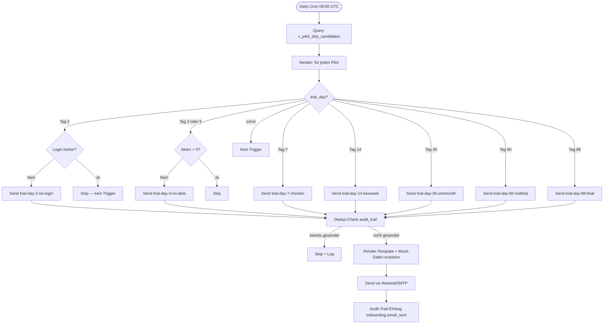

# PROVA Onboarding-Automation (Drip-Campaign)

**Stand:** 03.05.2026 abend (Sprint POST-MEGA-MEGA N2)
**Eigentümer:** Marcel (Make.com-Setup) + Claude Code (Templates)
**Zielgruppe:** Pilot-SVs in 90-Tage-Trial

---

## In Kürze

7-stufige Drip-Email-Campaign automatisch versendet basierend auf:
- **Trial-Tag** (Tag 2 / 3 / 7 / 14 / 30 / 60 / 88)
- **Aktivitäts-Status** (Login? Akten erstellt?)
- **Dedup-Check** (jede Email max 1× pro User)

Trigger via Make.com (Marcel-Account) **ODER** Supabase Edge Function + pg_cron (Backup-Implementierung).

---

## Drip-Campaign-Übersicht

```
Tag  | Trigger                        | Template                  | Subject
----|--------------------------------|---------------------------|----------------------------------
  2 | Signup vor 2T, kein Login      | trial-day-2-no-login      | Brauchen Sie Hilfe beim ersten Login?
  3 | Login OK aber 0 Akten          | trial-day-3-no-akte       | Lassen Sie mich Ihnen die erste Akte zeigen
  7 | (immer)                        | trial-day-7-checkin       | Erste Woche bei PROVA — wie war's?
 14 | (immer)                        | trial-day-14-twoweek      | PROVA nach 2 Wochen — Ihre Erfahrung?
 30 | (immer)                        | trial-day-30-onemonth     | 1 Monat PROVA — lass uns reflektieren
 60 | (immer)                        | trial-day-60-midtrial     | Halbzeit Ihrer 90-Tage-Trial
 88 | (immer, 2T vor Ende)           | trial-day-88-final        | PROVA-Trial endet in 2 Tagen — noch alles klar?
```

**Tonalität durchgehend:**
- Founder-zu-SV (persönlich, kein Marketing)
- Marcel als Absender
- Reply-To: kontakt@prova-systems.de
- Konkrete Aktionen + Fragen ("Antworten Sie mit einer Zahl 1-10")
- Kein Hype-Sprech ("revolutionär", "game-changing")

---

## Decision-Tree



---

## Re-Engagement-Logic

### Fallback-Trigger
| Situation | Standard-Trigger | Fallback |
|---|---|---|
| 0 Aktivität nach 5 Tagen (Tag-2-Email skip) | trial-day-2-no-login (Tag 2) | Re-Trigger Tag 5 |
| Akte erstellt nach trial-day-3-no-akte | n/a | weitere "no-akte"-Reminders skip |
| Cancel-Click → workspace.abo_status='gekuendigt' | n/a | Nur trial-day-88-final senden, alles andere skip |
| Bouncing Email (3× hard-bounce) | n/a | Email-Trigger pausieren, Marcel-Notification |

### Dedup-Mechanismus
Jede gesendete Email schreibt in `audit_trail`:
```json
{
  "typ": "onboarding.email_sent",
  "workspace_id": "<uuid>",
  "details": {
    "template": "trial-day-7-checkin",
    "trial_day": 7,
    "sent_at": "2026-05-10T09:00:00Z"
  }
}
```

Pre-Send-Check: existiert Eintrag mit `template = X` für `workspace_id = Y`? → Skip.

---

## Implementation-Optionen

### Option A — Make.com (Marcel hat Account)

**Aufwand:** ~1h Setup im Make-UI, Backup-JSON in `email-templates/onboarding/make-scenario-backup.json`.

**Module-Kette:**
1. Schedule Trigger (daily 09:00 UTC)
2. Supabase: `SELECT * FROM v_pilot_drip_candidates`
3. Iterator
4. Router (Decision-Tree mit 7 Routen)
5. Supabase Dedup-Lookup
6. HTTP GET Email-Template (raw.githubusercontent)
7. Resend API POST
8. Supabase Audit-Trail INSERT
9. Sentry / GitHub-Issue bei Error

**Vorteil:** Visual-Editor, einfach zu debuggen.
**Nachteil:** Marcel-Pflicht in Make-UI (weiterer Vendor).

### Option B — Supabase Edge Function + pg_cron (Backup)

**Aufwand:** ~3h Implementation, vollautomatisch in Supabase.

```sql
-- Voraussetzung: pg_cron + http extensions aktiviert
CREATE EXTENSION IF NOT EXISTS pg_cron;
CREATE EXTENSION IF NOT EXISTS http;

SELECT cron.schedule(
  'pilot-drip-daily',
  '0 9 * * *',
  $$SELECT net.http_post(
    url := 'https://prova-systems.de/.netlify/functions/cron-pilot-drip',
    headers := '{"Authorization": "Bearer ' || current_setting('app.internal_secret') || '"}'::jsonb
  )$$
);
```

Dann eigene Function `cron-pilot-drip.js`:
- Service-Role-Auth
- Liest `v_pilot_drip_candidates`
- Pro Pilot: Decision-Tree-Logic in JS
- Resend-API-Call mit gerendertem Template
- audit_trail-Insert

**Vorteil:** kein zusätzlicher Vendor, alles in PROVA-Stack.
**Nachteil:** Marcel-Implementation-Aufwand größer.

### Option C — Manueller Versand (Pilot-Phase, falls 0 Pilots)

Marcel sendet manuell die ersten 2-3 Drip-Mails wenn Pilot-SVs sich anmelden.
Kein Setup nötig. Skaliert nicht über 5 SVs.

---

## Pflicht-Voraussetzung: Supabase-View

Beide Auto-Optionen brauchen:

```sql
-- Marcel führt aus (ggf. PLANNED-Migration in supabase/migrations/)
CREATE OR REPLACE VIEW v_pilot_drip_candidates AS
SELECT
  w.id AS workspace_id,
  w.billing_email AS email,
  COALESCE(u.name, w.name) AS vorname,
  EXTRACT(DAY FROM (NOW() - COALESCE(w.abo_aktiv_seit, w.created_at)))::int AS trial_day,
  w.abo_status,
  w.abo_trial_endet_am,
  (SELECT COUNT(*) FROM auftraege a WHERE a.workspace_id = w.id) AS anzahl_akten,
  (SELECT MAX(u2.last_login_at)
   FROM users u2
   JOIN workspace_memberships m ON m.user_id = u2.id
   WHERE m.workspace_id = w.id
     AND m.is_active = true) AS last_login_at
FROM workspaces w
LEFT JOIN workspace_memberships m ON m.workspace_id = w.id AND m.is_active = true
LEFT JOIN users u ON u.id = m.user_id
WHERE w.abo_status IN ('trial', 'aktiv')
  AND w.deleted_at IS NULL;
```

→ als PLANNED_*.sql vorbereiten, Marcel testet in Dev → Production.

---

## Tests

### Mock-Pilot anlegen (lokal)
Marcel führt aus:
```sql
INSERT INTO workspaces (name, billing_email, abo_status, abo_aktiv_seit, abo_trial_endet_am)
VALUES (
  '__test_pilot_drip__',
  'marcel-test+drip@example.com',
  'trial',
  NOW() - INTERVAL '7 days',  -- Tag 7
  NOW() + INTERVAL '83 days'
);
```

Dann manuell `cron-pilot-drip` triggern (Stripe-Manual-Trigger oder Make-Run-Once):
- Erwartet: trial-day-7-checkin wird versendet
- Verify in audit_trail: Eintrag mit template='trial-day-7-checkin'
- Re-Run: Skip wegen Dedup

### Render-Check
```bash
node scripts/email-render-check.js
# Erwartet: alle 7 onboarding-Templates rendern, 0-7 viewport-Hinweise (Templates haben jetzt viewport-meta — sollte 0 sein)
```

---

## Email-Subjects (Marcel-Reference)

| Template | Subject |
|---|---|
| trial-day-2-no-login | Brauchen Sie Hilfe beim ersten Login? |
| trial-day-3-no-akte | Lassen Sie mich Ihnen die erste Akte zeigen |
| trial-day-7-checkin | Erste Woche bei PROVA — wie war's? |
| trial-day-14-twoweek | PROVA nach 2 Wochen — Ihre Erfahrung? |
| trial-day-30-onemonth | 1 Monat PROVA — lass uns reflektieren |
| trial-day-60-midtrial | Halbzeit Ihrer 90-Tage-Trial |
| trial-day-88-final | PROVA-Trial endet in 2 Tagen — noch alles klar? |

---

## Marcel-Pflicht-Aktionen

### Vor Pilot-Launch (Pflicht)
- [ ] **PLANNED-Migration `v_pilot_drip_candidates`** in Dev applizieren + Production
- [ ] **Make-Scenario** importieren aus `email-templates/onboarding/make-scenario-backup.json` (oder Edge-Function bauen)
- [ ] **Resend-API-Key** in Make.com (oder Netlify-ENV) hinterlegen
- [ ] **Test mit Mock-Pilot** (siehe „Tests" oben)

### Nach Pilot-Launch (laufend)
- [ ] **Wöchentlich:** audit_trail prüfen — kommen Drip-Mails an?
- [ ] **NPS-Antworten** aus trial-day-14-twoweek aggregieren (manuelle Excel?)
- [ ] **Feature-Request-Antworten** aus trial-day-30-onemonth in BACKLOG.md übernehmen

---

## Lessons / Backlog

- **Subject-Personalisierung:** "Marcel, brauchen Sie Hilfe?" könnte Open-Rate erhöhen → Sprint-Erweiterung wenn Make-Sponsor-Plan
- **A/B-Testing:** Tag-7 vs Tag-5 für Wochen-Check-In — testen mit erstem Cohort
- **Bounce-Handler:** noch nicht implementiert (Audit 14 Email-Security EM-05) → wenn Bounce-Rate > 5% nachrüsten
- **Plain-Text-Fallback:** Templates aktuell nur HTML — bei Email-Client-Inkompatibilität evtl. Plain-Text-Variante ergänzen

---

*Onboarding-Automation 03.05.2026 abend · Marcel-Make-Setup pending*
