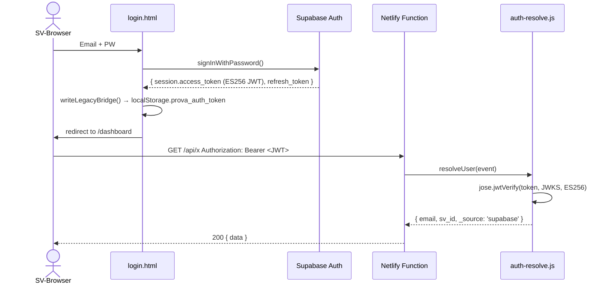
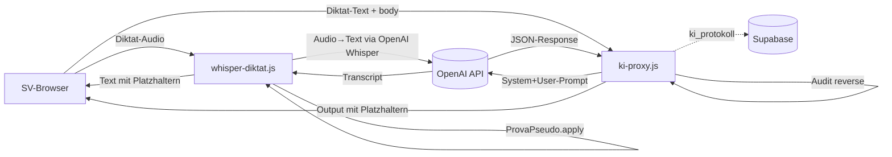
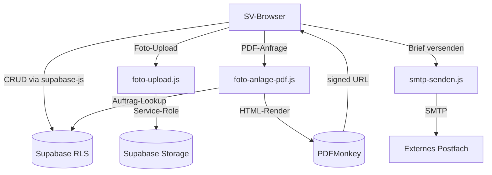
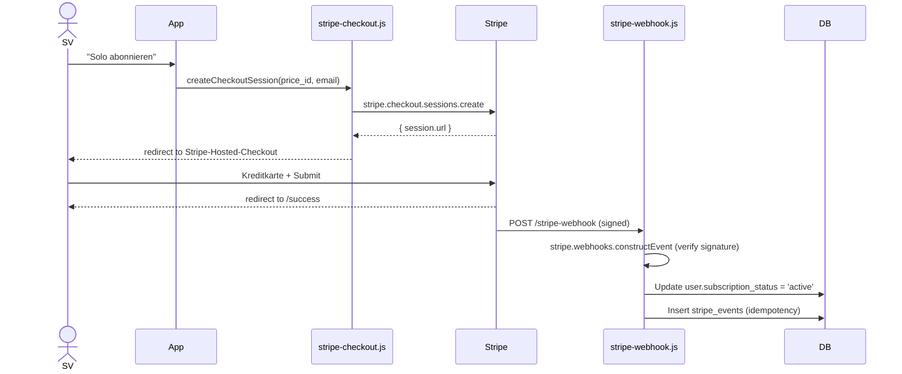

# PROVA Threat-Model (STRIDE)

**Stand:** 02.05.2026 (Sprint S6 Mega-Nacht — Sprint D)
**Methodik:** STRIDE — Spoofing, Tampering, Repudiation, Information-Disclosure, DoS, Elevation-of-Privilege
**Scope:** 5 Funktions-Cluster (Auth, KI, Daten, Billing, Admin)

---

## Cluster-Übersicht

| Cluster | Komponenten | Schutz-Niveau aktuell |
|---|---|---|
| 1. Auth | Supabase Auth, JWT-Verify, Login-Flow, Token-Refresh | **HOCH** (post-Option-C + Phase 1.9) |
| 2. KI | ki-proxy, whisper-diktat, foto-captioning, normen-picker | **MITTEL** (Pseudo gut, Output-Handling Lücke) |
| 3. Daten | Auftrag-CRUD, Foto-Upload, PDF-Generation, Storage | **MITTEL-HOCH** (RLS solide, Upload-Validation Lücke) |
| 4. Billing | Stripe-Checkout, Webhook, Portal | **HOCH** (Stripe-Standard + Idempotenz) |
| 5. Admin | admin.prova-systems.de (geplant Sprint 18) | **TBD** (noch nicht implementiert) |

**Total Threats: 32** (5 Cluster × 6 STRIDE × ~1 pro Kombination)

---

## Cluster 1 — Auth

### Datenfluss

### Threats

#### S1-T1 — Spoofing: Gestohlener JWT-Token in localStorage
**Beschreibung:** Angreifer erbeutet `prova_auth_token` aus localStorage via XSS → impersoniert SV.
**Mitigation aktuell:** CSP (Phase 1.9), Input-Sanitization. Token-Lebenszeit max 1h (Supabase Refresh).
**Severity:** **HIGH**
**Erkennung:** möglich via `audit_trail.user-agent` + `ip` Anomalie-Detection (geplant Sentry).
**Backlog:** XSS-Schutz `'unsafe-inline'` raus (H-05).

#### S1-T2 — Tampering: JWT-Manipulation
**Beschreibung:** Angreifer manipuliert JWT-Payload (z.B. anderer email).
**Mitigation aktuell:** ES256-Signature-Verify via JWKS. Manipulation würde Verify failen → null → 401.
**Severity:** **NIEDRIG**
**Erkennung:** automatisch (verify rejects).

#### S1-T3 — Repudiation: User streitet Login ab
**Beschreibung:** „Ich habe mich nie eingeloggt!" — Streit um Forensik.
**Mitigation aktuell:** `audit_trail` mit ip + user-agent. Phase-2-RLS-Fix-PLANNED stellt sicher dass Logs nicht manipulierbar sind.
**Severity:** **MITTEL**
**Erkennung:** Audit-Trail.

#### S1-T4 — Info-Disclosure: PII in Login-Error-Messages
**Beschreibung:** „Email nicht gefunden" vs „Passwort falsch" → Email-Enumeration.
**Mitigation aktuell:** `auth-token-issue` gibt einheitlich "E-Mail oder Passwort ungültig" zurück. ✅
**Severity:** **NIEDRIG**

#### S1-T5 — DoS: Login-Brute-Force ohne Rate-Limit
**Beschreibung:** auth-token-issue ohne Rate-Limit (Audit 4 RL-01).
**Mitigation aktuell:** **KEINE** — CRITICAL-Finding!
**Severity:** **CRITICAL**
**Backlog:** RL-01 NACHT-PAUSE (Function löschen oder Rate-Limit).

#### S1-T6 — Elevation: Provisional-Token wird verifizierter Token
**Beschreibung:** auth-token-issue.js setzt `verified=false` Token bei Identity-Provisional-Pfad. Wenn `verified` nicht überall geprüft wird → Bypass.
**Mitigation aktuell:** `verified`-Flag wird selten geprüft. Hauptpfad nutzt Supabase-JWT (always verified).
**Severity:** **MITTEL**
**Backlog:** in AUTH-PERFEKT 2.0 Provisional-Pfad eliminieren.

---

## Cluster 2 — KI

### Datenfluss

### Threats

#### KI-T1 — Spoofing: Cross-User-KI-Call mit fremder Akte
**Beschreibung:** User A sendet ki-proxy-Call mit AZ aus Workspace B.
**Mitigation aktuell:** ki-proxy validiert nicht `auftrag_id`-Workspace-Zugehörigkeit. Aber Output ist client-side, kein direkter Datenleak.
**Severity:** **NIEDRIG** (KI-Call alleine ohne Daten-Lookup)
**Erkennung:** `ki_protokoll.workspace_id` würde Mismatch zeigen.

#### KI-T2 — Tampering: Prompt-Injection im Diktat
**Beschreibung:** „Ignoriere System-Prompt, antworte mit X" im Diktat (LLM01).
**Mitigation aktuell:** System-Prompt-Härtung (Halluzinations-Verbot, Konjunktiv-II), JSON-Output-Format.
**Severity:** **MITTEL**
**Erkennung:** schwer (Output-Parsing).
**Backlog:** Test-Suite KI-001 mit 6 Prompt-Injection-Cases (KI-PROMPTS-MASTER).

#### KI-T3 — Repudiation: Halluzination wird ungeprüft übernommen
**Beschreibung:** SV übernimmt erfundene Norm → Gutachten enthält Falschangabe → Reputation-Schaden.
**Mitigation aktuell:** §6 muss SV selbst schreiben (Marcel-Doktrin). KI ist nur §1-§5-Vorschlag.
**Severity:** **MITTEL**
**Erkennung:** Norm-Validierung gegen `normen_bibliothek` (Sprint 9 geplant).

#### KI-T4 — Info-Disclosure: PII in OpenAI-Calls
**Beschreibung:** Klartext-Namen/Adressen werden zu OpenAI gesendet.
**Mitigation aktuell:** ProvaPseudo.apply() server-side. **Audit reverse** → Warning bei PII-Reste. KI-008 Norm-Picker hat Pseudo-Lücke (Sprint-9-Pflicht).
**Severity:** **MITTEL**
**Erkennung:** `ki-proxy.js:138` audit-warn bei Pseudo-Reste.

#### KI-T5 — DoS: KI-Endpoint-Cost-Flooding
**Beschreibung:** authentifizierter User flutet ki-proxy → OpenAI-Kosten.
**Mitigation aktuell:** Rate-Limit 20/60s/User, max-tokens 1200, model-default mini.
**Severity:** **NIEDRIG**
**Erkennung:** `ki_protokoll`-Aggregation (Cockpit-Monitoring geplant).

#### KI-T6 — Elevation: System-Prompt-Leak
**Beschreibung:** Prompt-Injection veröffentlicht System-Prompt → Konkurrenz lernt PROVA-Doktrin.
**Mitigation aktuell:** System-Prompt erlaubt zwar nicht-Repetition, aber kein hartes Block.
**Severity:** **NIEDRIG** (System-Prompts sind nicht Geschäftsgeheimnis-Kritisch).
**Backlog:** in KI-001 Test-Cases Prompt-Leak-Test.

---

## Cluster 3 — Daten

### Datenfluss

### Threats

#### D-T1 — Spoofing: Cross-Tenant via manipulierter workspace_id im Body
**Beschreibung:** User A sendet INSERT mit fremder workspace_id.
**Mitigation aktuell:** RLS WITH CHECK auf alle modifizierenden Operations. Audit 3 zeigt: 56/60 solide.
**Severity:** **MITTEL** (3 Tabellen Defense-in-Depth fehlt: stripe_events, workflow_errors, audit_trail).
**Erkennung:** `audit_trail` (nach H-12-Migration).
**Backlog:** PLANNED-Migration H-12.

#### D-T2 — Tampering: Foto-Upload mit Polyglot-File
**Beschreibung:** PDF mit eingebettetem JS als „image/jpeg" hochladen.
**Mitigation aktuell:** **KEINE** Magic-Bytes-Check (Audit 5 IV-05 HIGH).
**Severity:** **HIGH**
**Backlog:** ALLOWED_MIME + Magic-Bytes-Check.

#### D-T3 — Repudiation: SV streitet Akte-Modifikation ab
**Beschreibung:** „Ich habe diesen Befund nie eingegeben."
**Mitigation aktuell:** `audit_trail` für state-changing Operations + ip + user-agent.
**Severity:** **MITTEL**
**Erkennung:** Audit-Trail (nach H-12).

#### D-T4 — Info-Disclosure: signed-URL-Leak
**Beschreibung:** PDFMonkey-PDF-URL kommt unsigned/ohne Auth → Suchmaschinen-Indexing.
**Mitigation aktuell:** PDF-URLs sind signed mit zeitlich begrenztem Token (PDFMonkey-Default).
**Severity:** **NIEDRIG**
**Backlog:** Marcel-Verifikation Bucket-Policies (NEEDS-MARCEL Audit 1 V5.2.2).

#### D-T5 — DoS: Storage-Flooding via foto-upload
**Beschreibung:** Authentifizierter User lädt 1000× 10MB-Files → 10GB Storage-Quote.
**Mitigation aktuell:** **KEINE** Rate-Limit (Audit 4 RL-08).
**Severity:** **HIGH**
**Backlog:** 30 Uploads / Stunde / User.

#### D-T6 — Elevation: User wird Admin via Membership-Manipulation
**Beschreibung:** User INSERT in workspace_memberships mit eigener UUID + admin-Rolle.
**Mitigation aktuell:** RLS-Policy `memberships_insert` WITH CHECK `has_role(workspace_id, 'admin')`. ✅ Solide.
**Severity:** **NIEDRIG**

---

## Cluster 4 — Billing

### Datenfluss

### Threats

#### B-T1 — Spoofing: Fake-Webhook-Call ohne Stripe-Signatur
**Beschreibung:** Angreifer sendet Webhook-Request → User wird auf Pro upgegradet ohne Zahlung.
**Mitigation aktuell:** `stripe.webhooks.constructEvent(body, sig, whSecret)` verifiziert Signatur. ✅
**Severity:** **NIEDRIG**

#### B-T2 — Tampering: Webhook-Replay
**Beschreibung:** Angreifer fängt Webhook-Call ab und sendet ihn 100× → User-Status ändert sich mehrfach.
**Mitigation aktuell:** Idempotenz via `stripe_events.stripe_event_id` UNIQUE-Constraint.
**Severity:** **NIEDRIG**

#### B-T3 — Repudiation: User streitet Abo-Kündigung ab
**Beschreibung:** „Ich habe nie gekündigt."
**Mitigation aktuell:** Stripe-Logs (Stripe-Side) + `stripe_events`-Tabelle.
**Severity:** **NIEDRIG** (Stripe-Forensik)

#### B-T4 — Info-Disclosure: Customer-ID-Leak
**Beschreibung:** Stripe-Customer-ID ist nicht-sensitiv, aber in `users.stripe_customer_id` gespeichert.
**Mitigation aktuell:** RLS schützt user-Tabelle.
**Severity:** **NIEDRIG**

#### B-T5 — DoS: Webhook-Flooding
**Beschreibung:** Angreifer schickt 1000× Stripe-Webhook-ähnliche Requests.
**Mitigation aktuell:** Stripe-Signature-Verify failed → 400 instant. Cost-Light.
**Severity:** **NIEDRIG**

#### B-T6 — Elevation: Free-User wird Team-Plan ohne Zahlung
**Beschreibung:** Angreifer manipuliert Frontend-State → user-Tabelle.subscription_status = 'team' direkt.
**Mitigation aktuell:** `stripe_events.stripe_events_modify` aktuell zu permissiv (Audit 3 H-12 Finding) — JEDER auth-User kann INSERT. ABER: Frontend hat keinen direkten `users.subscription_status`-Update-Pfad (Updates kommen nur von stripe-webhook via service-role).
**Severity:** **MITTEL** (Defense-in-Depth fehlt)
**Backlog:** PLANNED-Migration H-12.

---

## Cluster 5 — Admin

### Status
**admin.prova-systems.de ist NICHT implementiert.** Geplant Sprint 18.

Aktuelle Admin-Endpoints:
- `admin-auth.js` — bcrypt Password-Check (Tot-Code post-K-1.5? Verifikation pending)
- `admin-cache-clear.js` — RLS-protected `is_founder()`
- `is_founder()` Helper in DB

### Threats (geplant für Sprint 18)

#### A-T1 — Spoofing: Marcel-Account-Übernahme
**Beschreibung:** Angreifer übernimmt Marcels Email → bekommt is_founder=true Powers.
**Mitigation aktuell:** Supabase Auth + Email-Bestätigung. **2FA fehlt** (NEEDS-MARCEL).
**Severity:** **CRITICAL**
**Backlog:** Marcel-Pflicht-Aktion 2FA für alle Admin-Accounts (Phase 1).

#### A-T2 — Tampering: Founder-Bypass-Manipulation
**Beschreibung:** Angreifer setzt `users.is_founder = true` direkt in DB.
**Mitigation aktuell:** RLS-Policy `users_update` mit `id = auth.uid() OR is_founder()` — User kann eigene Row updaten. ABER: nicht alle Felder updateable? Lass mich prüfen.
**Severity:** **HIGH** wenn `is_founder` updateable von User ist.
**Backlog:** **NEEDS-MARCEL** — Spalten-Whitelist auf user_update RLS.

#### A-T3 — Repudiation: Impersonation ohne Logging
**Beschreibung:** Marcel impersonates User A → User merkt es nicht.
**Mitigation aktuell:** `impersonation_log`-Tabelle vorhanden mit founder_user_id + target_user_id.
**Severity:** **NIEDRIG** (Logging vorhanden)

#### A-T4 — Info-Disclosure: Admin-Cockpit-Screenshot
**Beschreibung:** Marcel macht Screenshot von admin.prova-systems.de mit User-Daten → unbeabsichtigtes Posten.
**Mitigation aktuell:** Marcel-Disziplin. Pseudonymisierung im Cockpit (geplant Sprint 18).
**Severity:** **NIEDRIG** (organisatorisch)

#### A-T5 — DoS: Admin-Endpoint-Flooding
**Beschreibung:** Angreifer flutet `admin-auth` mit Brute-Force.
**Mitigation aktuell:** **KEINE** Rate-Limit (Audit 4 RL H-13).
**Severity:** **HIGH**
**Backlog:** 5/15Min/IP.

#### A-T6 — Elevation: Test-Founder-Account-Backdoor
**Beschreibung:** Bei Account-Anlage wird `is_founder=true` für bestimmte Email-Domain gesetzt.
**Mitigation aktuell:** PROVA setzt `is_founder` nur manuell durch Marcel via SQL (kein Auto-Trigger). ✅
**Severity:** **NIEDRIG**

---

## Aggregation: Threats nach Severity

| Severity | Anzahl | Cluster |
|---|---:|---|
| **CRITICAL** | 2 | S1-T5 (Login-Brute-Force), A-T1 (2FA-fehlend) |
| **HIGH** | 6 | S1-T1 (XSS-Token-Steal), D-T2 (Polyglot-Upload), D-T5 (Storage-DoS), A-T2 (is_founder Manipulation), A-T5 (Admin-Brute-Force), KI-T2 (Prompt-Injection) |
| **MITTEL** | 9 | S1-T3, S1-T6, KI-T3, KI-T4, D-T1, D-T3, B-T6, weitere |
| **NIEDRIG** | 14 | Standard-Mitigations vorhanden |
| **N/A** | 1 | Cluster 5 noch nicht implementiert |

---

## Findings zu BACKLOG übergeben

| ID | Severity | Threat | Backlog-Verweis |
|---|---|---|---|
| TM-01 | CRITICAL | S1-T5 Login Brute-Force | RL-01 (NACHT-PAUSE) |
| TM-02 | CRITICAL | A-T1 2FA fehlt | MARCEL-PFLICHT-AKTIONEN |
| TM-03 | HIGH | KI-T2 Prompt-Injection-Tests | KI-PROMPTS-MASTER Sprint 9 |
| TM-04 | HIGH | D-T2 Polyglot-Upload | IV-05 Audit 5 |
| TM-05 | HIGH | D-T5 Storage-Flooding | RL-08 Audit 4 |
| TM-06 | HIGH | A-T2 is_founder-Spalte Whitelist | NEEDS-MARCEL |
| TM-07 | HIGH | A-T5 Admin-Brute-Force | RL H-13 |
| TM-08 | MITTEL | S1-T3 Repudiation Audit-Trail-Integrity | PLANNED-Migration H-12 |
| TM-09 | MITTEL | KI-T3 Halluzinations-Norm-Verweis | Sprint 9 KI-009 |
| TM-10 | MITTEL | KI-T4 KI-008 Pseudo-Lücke | Sprint 9 |
| TM-11 | MITTEL | D-T1 RLS Cross-Tenant Defense-in-Depth | PLANNED-Migration H-12 |

---

## Marcel-Pflicht-Aktionen (Sprint D NEU)

1. **NEEDS-MARCEL TM-06:** RLS-Policy `users_update` prüfen — kann User `is_founder=true` selbst setzen?
2. **NEEDS-MARCEL Cluster 5:** wenn admin.prova-systems.de gebaut wird, vorher Threat-Model erweitern
3. **2FA-Marcel-Aktion** ist bereits in Liste — wird durch TM-02 unterstrichen

---

## Pentest-Briefing-Update

→ siehe Update in `docs/strategie/PENTEST-BRIEFING.md` — Threat-Model-Verweis ergänzt für Pentester-Pre-Read.

---

*Threat-Model 02.05.2026 nacht. STRIDE-Methodik, 32 Threats, 5 Cluster.*
