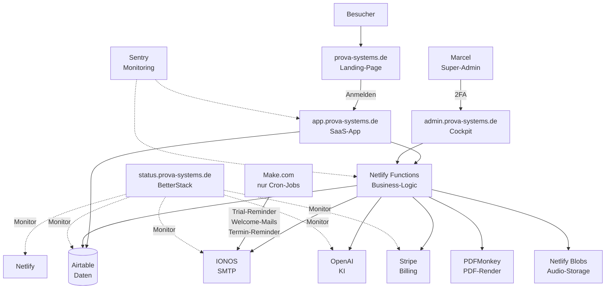
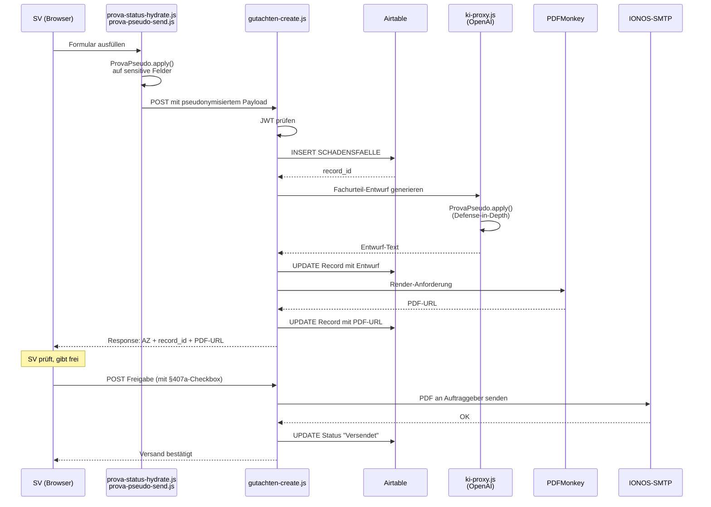
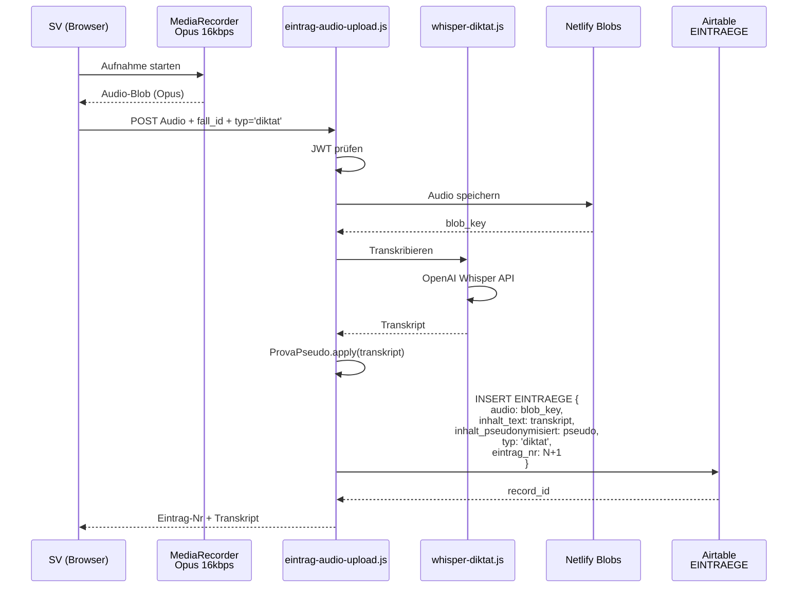
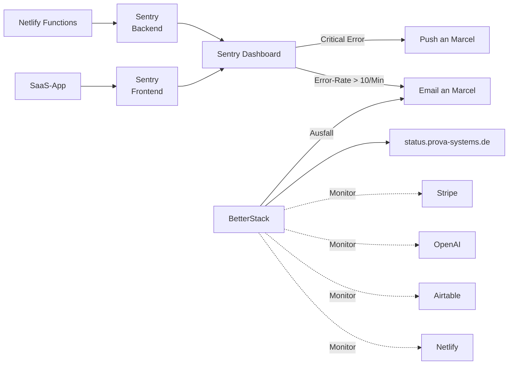

# System-Architektur (Soll-Zustand nach Masterplan v2)

---

## Domain-Struktur



---

## Datenfluss: Neuer Fall (Flow A)



---

## Datenfluss: Diktat-Aufnahme



---

## Airtable-Tabellen-Map

| Tabelle | Table-ID | User-Field | Zweck |
|---|---|---|---|
| **SACHVERSTAENDIGE** | tbladqEQT3tmx4DIB | id | SV-Accounts |
| **SCHADENSFAELLE** | tblSxV8bsXwd1pwa0 | sv_email | Haupt-Fälle, alle Flows |
| **EINTRAEGE** | tblTcapjDGDI2f58h | sv_email | Diktate, Notizen, Skizzen |
| **TERMINE** | tblyMTTdtfGQjjmc2 | sv_email | Kalender, Fristen |
| **RECHNUNGEN** | tblF6MS7uiFAJDjiT | sv_email | Rechnungen + Angebote |
| **BRIEFE** | tblSzxvnkRE6B0thx | sv_email | Versendete Briefe |
| **KONTAKTE** | tblMKmPLjRelr6Hal | sv_email | CRM |
| **NORMEN** | tblnceVJIW7BjHsPF | — | Normen-Bibliothek (global) |
| **TEXTBAUSTEINE** | tbljPQrdMDsqUzieD | — | Standard-Textbausteine (global) |
| **TEXTBAUSTEINE_CUSTOM** | tblDS8NQxzceGedJO | sv_email | User-eigene Bausteine |
| **POSITIONEN_DATENBANK** | (eigene) | sv_email | Rechnungs-Positionen (user) |
| **KI_STATISTIK** | tblv9F8LEnUC3mKru | sv_email | KI-Usage pro User |
| **KI_LERNPOOL** | tbl4LEsMvcDKFCYaF | — | Feedback-Pool |
| **AUDIT_TRAIL** | tblqQmMwJKxltXXXl | sv_email | Alle wichtigen Events |
| **STATISTIKEN** | tblb0j9qOhMExVEFH | sv_email | Aggregationen |
| **PUSH_SUBSCRIPTIONS** | tblAiF38HeS1R1Umj | sv_email | Push-Notifications |
| **EINWILLIGUNGEN** | tblwgUQgtBWckPMHp | sv_email | DSGVO-Einwilligungen |
| **RECHTSDOKUMENTE** | tbljJkS3HOvtmpAGT | — | AGB/Datenschutz-Versionen |
| **WORKFLOW_ERRORS** | tblgECx0eyrpQTN8e | sv_email | Error-Log |

**Noch unklar (aus Code extrahiert, sollte Marcel klären):**
- `tbli4t2WDLeBfuBB2` — ???
- `tblaboaRkJjrX3Z4J` — ???

Diese zwei Table-IDs sind im Code referenziert, aber haben kein Alias in der Whitelist. Sollten in Sprint 4 (P5 Reste) identifiziert und entweder sauber registriert oder entfernt werden.

---

## Netlify Functions (Ziel-Zustand nach Masterplan v2)

| Function | Zweck | JWT-Pflicht | Neu in v2? |
|---|---|---|---|
| `airtable.js` | Universeller Airtable-Proxy | ✅ | existiert |
| `auth-token.js` | HMAC-Token Sign/Verify | — | **NEU (Sprint 02)** |
| `ki-proxy.js` | OpenAI-Router (GPT-4o/mini) | ✅ | existiert, wird abgesichert |
| `whisper-diktat.js` | Audio → Text | ✅ | existiert, wird scharfgeschaltet |
| `foto-captioning.js` | Foto → Beschreibung | ✅ | existiert |
| `pdf-proxy.js` | Signierte PDF-URLs | ✅ | existiert (Goldstandard) |
| `gutachten-create.js` | G1-Flow-Ersatz | ✅ | **NEU (Sprint 13)** |
| `gutachten-freigabe.js` | G3-Flow-Ersatz | ✅ | **NEU (Sprint 14)** |
| `support-chat.js` | K2-Flow-Ersatz | ✅ | **NEU (Sprint 14)** |
| `rechnung-erstellen.js` | F1-Flow-Ersatz | ✅ | **NEU (Sprint 14)** |
| `admin-notify.js` | A5-Flow-Ersatz | ✅ | **NEU (Sprint 14)** |
| `eintrag-audio-upload.js` | Audio-Upload + Whisper | ✅ | **NEU (Sprint 06)** |
| `stripe-checkout.js` | Stripe-Session | ✅ | existiert (v2 aus v98) |
| `stripe-webhook.js` | Stripe-Events | HMAC | existiert, L3-Logik integriert |
| `stripe-portal.js` | Kunden-Portal | ✅ | existiert |
| `dsgvo-auskunft.js` | Art. 15 | ✅ | existiert, wird scharfgeschaltet |
| `dsgvo-loeschen.js` | Art. 17 | ✅ | existiert, wird scharfgeschaltet |
| `backup-airtable.js` | Nightly Backup | Scheduled | **NEU (Sprint 15)** |
| `push-notify.js` | Push-Notifications | ✅ | existiert, wird abgesichert |
| `rechnung-pdf.js` | Rechnungs-PDF | ✅ | existiert |
| `mahnung-pdf.js` | Mahnungs-PDF | ✅ | existiert |
| `brief-pdf-senden.js` | Brief-PDF + Mail | ✅ | existiert |
| `jahresbericht-pdf.js` | Jahresbericht | ✅ | existiert, wird gefixt (Sprint 04) |
| `foto-upload.js` | Foto-Upload | ✅ | existiert (v98, Airtable-native) |
| `foto-anlage-pdf.js` | Fotoanlage | ✅ | existiert |
| `health.js` | Status-Endpoint | öffentlich | existiert |
| `emails.js` | Netlify-Emails-Wrapper | ✅ | existiert |
| `identity-signup.js` | Neu-Registrierung | öffentlich | existiert, wird gehärtet (Sprint 02) |
| `invite-user.js` | Team-Invite | ✅ | existiert |
| `smtp-*` | IONOS-SMTP-Integration | ✅ | existiert |

---

## Make.com (nur noch 4 Cron-Szenarien)

| Szenario | ID | Zweck | Warum bleibt |
|---|---|---|---|
| **L8** | 5147509 | Welcome-Mails 1/3/7/14 Tage nach Signup | Cron ideal |
| **L9** | 5147516 | Trial-Reminder (Tag 7, 10, 12 des Trials) | Cron ideal |
| **L10** | 5158552 | Churn-Prevention-Mails | Cron ideal |
| **T3** | 5147519 | Termin-Reminder (1 Tag vorher) | Cron ideal, Gmail-Connection |

**Alle anderen Make-Szenarien werden in Sprint 13-14 zu Netlify migriert:**
- G1 Gutachten → gutachten-create.js
- G3 Freigabe → gutachten-freigabe.js
- K2 Support → support-chat.js
- L3 Stripe → integriert in stripe-webhook.js
- F1 Rechnungen → rechnung-erstellen.js
- A5 Admin → admin-notify.js
- WH_S1, WH_S3 → in gutachten-freigabe.js konsolidiert
- Whisper-Webhook → whisper-diktat.js (scharfgeschaltet)

---

## Frontend-Module

### Kern-Komponenten (neu in v2)

| Modul | Datei | Zweck |
|---|---|---|
| Auth-Guard | `auth-guard.js` | Session-Verifikation (Legacy-Migration in Sprint 02 entfernt) |
| Sanitizer | `prova-sanitize.js` | XSS-Escape (aus Sprint 02 heute) |
| Pseudo-Send | `prova-pseudo-send.js` | **NEU (Sprint 01):** Wrapper für alle KI-Fetches |
| Status-Hydrate | `prova-status-hydrate.js` | Abo-Status aus Backend (aus Sprint 0 heute) |
| Bibliothek-Toolbar | `prova-bibliothek-toolbar.js` | **NEU (Sprint 08):** Universal-Komponente |
| Timeline | `prova-timeline.js` | **NEU (Sprint 11):** Flow-agnostisch Phasen rendern |
| Einträge-Manager | `prova-eintraege.js` | **NEU (Sprint 06):** Diktat/Notiz/Skizze |
| Skizzen-Canvas | `prova-skizze.js` | **NEU (Sprint 07):** Canvas mit Tier 1+2 Werkzeugen |
| Theme | `theme.js` | Dark-Mode (existiert) |
| Service-Worker | `sw.js` | Cache + Offline |

### Seiten-Logic (angepasst)

| Seite | Logic-File | Haupt-Änderungen in v2 |
|---|---|---|
| Landing | — | Subdomain-Split |
| App (Neuer Fall) | `app-logic.js` | Auftragstyp-Felder (Sprint 10), sammleDaten() für Einträge (Sprint 06) |
| Dashboard | `dashboard-logic.js` | Phasen-Fristen-Widget (Sprint 11) |
| Akte | `akte-logic.js` | Flow-agnostische Timeline (Sprint 11), Einträge-Anzeige (Sprint 06) |
| Ortstermin-Modus | (neu: `ortstermin-logic.js`) | Komplett-Umbau (Sprint 06, 07): Einträge-Liste, Skizze-Tab |
| Freigabe | `freigabe-logic.js` | §407a-Checkbox (Sprint 16) |
| Stellungnahme | `stellungnahme-logic.js` | KI-als-Werkzeug (Sprint 09), Bibliothek-Toolbar (Sprint 08) |
| Rechnungen | `rechnungen-logic.js` | Auto-Gen nach Freigabe (Sprint 12) |
| Kontakte | `kontakte-logic.js` | Import aus Sprint 05 |
| Termine | `termine-logic.js` | Google-Cal-Sync bleibt (Make-T3) |
| Einstellungen | `einstellungen-logic.js` | Einwilligungs-Management (Sprint 17) |
| Import-Assistent | `import-assistent-logic.js` | Komplett-Umbau (Sprint 05): Airtable-Schreibend |
| Admin-Cockpit | (neu: `cockpit-logic.js`) | **NEU (Sprint 18)** |

---

## Storage-Architektur

```
┌──────────────────────────────────────────┐
│          Airtable                        │
│  ┌────────────────────────────────────┐ │
│  │ Text-Records (Fälle, Einträge,     │ │
│  │   Kontakte, Rechnungen, etc.)      │ │
│  └────────────────────────────────────┘ │
│  ┌────────────────────────────────────┐ │
│  │ Attachments:                       │ │
│  │  - Fotos (aus v98)                 │ │
│  │  - Skizzen (PNG/SVG)               │ │
│  │  - PDFs (Gutachten/Rechnungen)     │ │
│  │  - Import-CSVs (temporär)          │ │
│  └────────────────────────────────────┘ │
└──────────────────────────────────────────┘
                    │
                    │ Referenziert
                    ▼
┌──────────────────────────────────────────┐
│          Netlify Blobs                   │
│  ┌────────────────────────────────────┐ │
│  │ Audio-Dateien (Opus 16kbps):       │ │
│  │  - audio/{sv_id}/{eintrag_nr}.opus │ │
│  └────────────────────────────────────┘ │
│  ┌────────────────────────────────────┐ │
│  │ Backup-Dumps (nightly):             │ │
│  │  - backups/{YYYY-MM-DD}.json.gz    │ │
│  └────────────────────────────────────┘ │
└──────────────────────────────────────────┘
                    │
                    │ Signed-URLs (pdf-proxy.js pattern)
                    ▼
┌──────────────────────────────────────────┐
│          Client (SV-Browser)             │
│  - HMAC-signierte URLs mit 15 Min TTL    │
│  - JWT-Auth vorgeschaltet                │
└──────────────────────────────────────────┘
```

**Bei Wachstum (> 50 SVs):** Cloudflare R2 für Audio + Backups (kosteneffizienter Migration, 1 Tag Aufwand).

---

## ENV-Variablen (Netlify)

**Bestehend (aus Memory):**
- AIRTABLE_PAT
- OPENAI_API_KEY
- STRIPE_SECRET_KEY
- STRIPE_WEBHOOK_SECRET (⚠️ ALT — wird in Sprint 15 rotiert)
- PDFMONKEY_API_KEY, PDFMONKEY_TEMPLATE_ID
- MAKE_WEBHOOK_KAUF, MAKE_WEBHOOK_WILLKOMMEN (bleiben für L8)
- MAKE_S3_WEBHOOK, MAKE_S4_WEBHOOK (L3, L10 — werden obsolet in Sprint 13-14)
- VAPID_PUBLIC_KEY, VAPID_PRIVATE_KEY, VAPID_SUBJECT
- ADMIN_PASSWORD_BCRYPT, ADMIN_HASH
- NETLIFY_EMAILS_SECRET, NETLIFY_EMAILS_DIRECTORY
- NETLIFY_IDENTITY_REDIRECT_URL
- NETLIFY_ACCESS_TOKEN
- PDF_PROXY_SECRET

**Neu in v2:**
- **AUTH_HMAC_SECRET** (Sprint 02) — für Session-Signatur
- **SENTRY_DSN** (Sprint 15) — Error-Tracking
- **BACKUP_BUCKET** (Sprint 15) — Netlify Blobs Backup
- **STATUS_PAGE_API** (Sprint 15) — BetterStack/UptimeRobot

---

## Sicherheits-Schichten (Ziel-Zustand)

```
┌─────────────────────────────────────────────┐
│ 1. Netlify Edge (DDoS, SSL, Region-Filter) │
├─────────────────────────────────────────────┤
│ 2. Permissions-Policy + CSP Headers         │
├─────────────────────────────────────────────┤
│ 3. CORS-Helper (prova-systems.de only)      │
├─────────────────────────────────────────────┤
│ 4. JWT-Auth (HMAC AUTH_HMAC_SECRET)         │
├─────────────────────────────────────────────┤
│ 5. Rate-Limit pro User (20 Calls/Min)       │
├─────────────────────────────────────────────┤
│ 6. Server-Pseudonymisierung vor OpenAI      │
├─────────────────────────────────────────────┤
│ 7. Airtable Tabellen-Whitelist + sv_email   │
├─────────────────────────────────────────────┤
│ 8. AUDIT_TRAIL (jede Aktion loggen)         │
└─────────────────────────────────────────────┘
```

Jede Schicht ist eigenständig wirksam. Selbst wenn eine Schicht bricht, halten die anderen.

---

## Monitoring-Architektur



---

## Test-Architektur

| Test-Typ | Tool | Wann |
|---|---|---|
| **Unit-Tests** | Node built-in `test` | Bei jedem neuen Modul |
| **Playwright E2E** | `tests/*.spec.js` | Pre-Deploy, Pre-Audit |
| **Manueller Browser-Test** | Marcel + Edge Inkognito | Nach jedem Sprint |
| **Server-Acceptance** | Claude Code via curl/grep | Nach jedem Sprint |
| **Smoke-Test** | Scheduled Playwright daily | Production-Monitoring |

**Playwright-Abdeckung (soll nach Sprint 20):**
- 01-login.spec.js (neu in v2 mit HMAC-Token)
- 02-authenticated-smoke.spec.js
- 03-workflows-flow-a.spec.js
- 04-workflows-flow-b.spec.js (neu)
- 05-security.spec.js (inkl. Pseudonymisierung)
- 06-compliance.spec.js (neu: §407a, EU AI Act, DSGVO)

---

**Dieses Dokument ist Referenz für alle Sprints und wird nach Sprint 20 final gemacht.**
